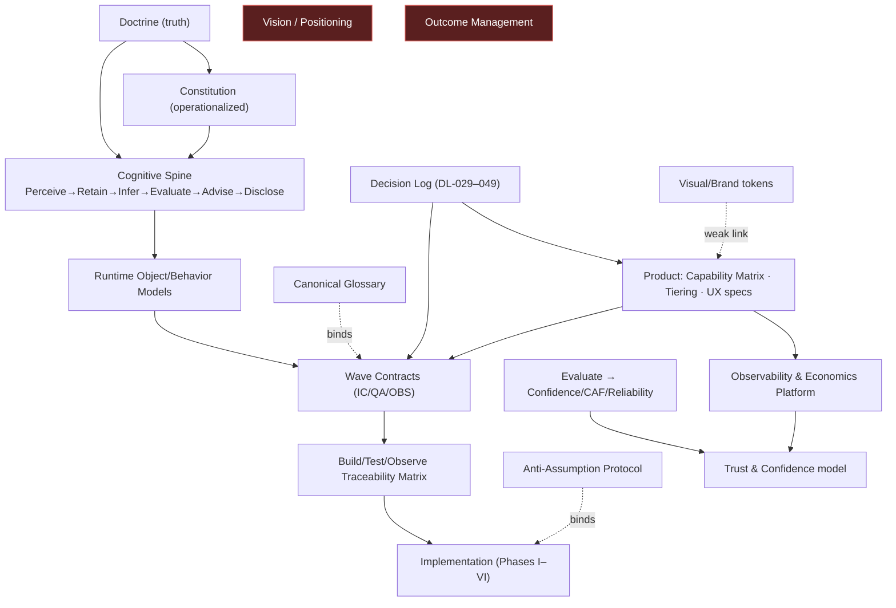

# OSLO Knowledge Integrity Audit (KIA) 001

**Document Type:** Independent Repository Knowledge-Integrity Audit · **Status:** Permanent governance artifact · **Date:** 2026-06-05
**Auditor stance:** Independent Repository Auditor · Knowledge Architect · Systems/Product Architect · Staff Engineer · Governance Analyst.
**Object under evaluation:** the repository *as a knowledge system* (not code quality). **Method:** repository evidence only; concepts without locatable evidence are marked **NOT DISCOVERABLE**; no inference, no gap-filling from prior knowledge.
**Scope basis:** 527 markdown files across `01_governance` (67) · `02_product` (163) · `03_architecture` (67) · `04_research` (17) · `05_execution` (11) + 11 root entry/drift-control docs.

---

## Core Question — answered

> *If a brand-new Claude Code instance were dropped in with no prior context, could it reconstruct OSLO and continue implementation without material interpretation drift?*

**Qualified YES — for the cognitive/governance/contract core; with bounded, addressable risk at the edges.**

The repository is **purpose-built against drift** in its core: `ANTI_ASSUMPTION_BUILD_PROTOCOL.md` (escalate-don't-invent), `CANONICAL_GLOSSARY.md` (one name per concept + banned synonyms), `RELEASE_1_BUILD_TEST_OBSERVE_TRACEABILITY_MATRIX.md` (capability→contract→test→event), the ratified `decision_log.md` (DL-029–DL-049), and the Wave contract packages are an unusually strong anti-drift apparatus. A new instance that follows `README.md → ANTI_ASSUMPTION_BUILD_PROTOCOL.md → START_HERE.md` will build the cognitive spine correctly.

**Material drift risk concentrates in six places** (all fixable): **(1)** `START_HERE.md`'s curated "read 6 docs" path is **stale** — it surfaces DL-043/044 but **not** DL-046/047/048/049 nor the recent telemetry/visual/economics specs; **(2)** Domain 1 (Vision/positioning) has **no canonical source**; **(3)** "Outcome Management" is **NOT DISCOVERABLE** as a defined concept; **(4)** the `legacy_layer_engineering/` directory **names** preserve deprecated layer terminology (mitigated by banners); **(5)** the **dual canonical-definitions surfaces** require a new instance to apply DL-036 to know which prevails; **(6)** 527 files impose real navigation load. None are core-architecture defects; all are knowledge-surface defects.

---

## 1. Repository Knowledge Health Scorecard

| Score | Value | Justification (evidence) |
|---|---|---|
| **Overall Knowledge Health** | **79 / 100** | Excellent governance/cognition/contract core; specific discoverability + vision/canon gaps drag the edges. |
| Overall Clarity | **78** | Canonical model crisply defined (`CANONICAL_GLOSSARY.md`, Cognitive Responsibility Spec); vision + a few canon terms unclear. |
| Overall Alignment | **82** | Doctrine-centered precedence (`REPOSITORY_ARCHITECTURE.md`) + decision log keep layers aligned; legacy residue + dual surfaces minor misalignment. |
| Overall Feasibility | **80** | Wave contracts + traceability matrix make the build executable; numeric NFR/test acceptance still partly TBD (`OPEN_TBD_REGISTER.md`). |
| Overall Confidence | **78** | High for cognitive core; lowered by stale entry path hiding the newest ratified decisions. |
| Overall Reliability | **80** | Append-only decision log + changelog (CHG-001…068) give strong traceability; version churn (data model V1/1.1/1.2) and reorg proposals add noise. |

**Dimension definitions** scored per finding: Discoverability (locatable?), Authority (which source rules?), Consistency (do sources agree?), Traceability (concepts connect?), Implementability (buildable from this?), Confidence (how sure should a future instance be?).

---

## 2. Domain Scorecards (0–100 per dimension)

| # | Domain | Disc | Auth | Consist | Trace | Implement | Conf | Canonical source (evidence) |
|---|---|---|---|---|---|---|---|---|
| 1 | **Vision** | 45 | 50 | 60 | 50 | 55 | 50 | **No single canonical source.** Foundational thesis in `doctrine/` (DL-001); product vision/positioning/category/Intralign mission scattered in `04_research/transcripts/01_foundational_product_experience.md` (non-canonical), `OSLO_ARCHITECTURE_BASELINE_V1.md`. |
| 2 | **Canon** | 72 | 78 | 68 | 74 | 70 | 70 | `01_governance/canonical_definitions/canonical_definitions.md`, `constitution/10_canonical_definitions.md`, `ontology/ontology_registry.md`. **"Outcome Management" NOT DISCOVERABLE**; Outcome Confidence/CAF well-defined. |
| 3 | **Product** | 80 | 82 | 80 | 82 | 80 | 80 | `02_product/specs/planning/OSLO_CAPABILITY_MATRIX_V2.md`, `tiering/12_freemium_tier_behavior_logic.md`, `specs/ux/*`, `OSLO_RELEASE_1_CANONICAL_SCOPE_V1.md`. Tiers 1–2 defined; 3–5 deferred (Open-TBD E3). |
| 4 | **Runtime Cognition** | 85 | 92 | 88 | 88 | 85 | 88 | `03_architecture/specifications/OSLO_COGNITIVE_RESPONSIBILITY_ARCHITECTURE_SPECIFICATION_V1.md`, `CANONICAL_GLOSSARY.md` (spine + banned layers). Residual: `legacy_layer_engineering/` dir names (bannered). |
| 5 | **Architecture** | 82 | 85 | 78 | 85 | 82 | 82 | Cognitive Responsibility Spec + `runtime_models/` (Object/Behavior) + `contracts/`. Noise: `OSLO_ARCHITECTURE_BASELINE_V1.md`, `REPOSITORY_REORGANIZATION_PROPOSAL_V1.md`, `…SIMPLIFICATION_PLAN.md`. |
| 6 | **Data & Storage** | 80 | 80 | 76 | 80 | 78 | 76 | `runtime_models/RELEASE_1_LOGICAL_DATA_MODEL_V1.md`, `RELEASE_1_RUNTIME_OBJECT_MODEL_V1.md`. **Churn:** data-model V1 / V1.1 / V1.2 + reconciliation patches — "which is current?" risk. |
| 7 | **Telemetry & Observability** | 60 | 80 | 75 | 72 | 80 | 72 | `02_product/specs/telemetry/OSLO_RELEASE_1_OBSERVABILITY_AND_ECONOMICS_PLATFORM_SPECIFICATION_V1.md` + `OBSERVABILITY_GOVERNANCE_SPECIFICATION_V1.md`. **Strong content, weak discoverability** (not in any entry doc). |
| 8 | **Trust & Confidence** | 80 | 85 | 82 | 82 | 80 | 82 | `Evaluate` responsibility; `02_product/specs/models/*` (Confidence/CAF/Reliability), False-Confidence (DL-047), Trust Index (telemetry spec), `testing_fixtures/RELEASE_1_CONFIDENCE_*`. |
| 9 | **Governance** | 90 | 92 | 88 | 90 | 85 | 90 | **Strongest domain.** `frameworks/framework_001(.A).md`, `decisions/decision_log.md`, `changelog/changelog.md`, `CLAUDE.md` (authority constraint), `ANTI_ASSUMPTION_BUILD_PROTOCOL.md`. |
| 10 | **Engineering** | 80 | 82 | 80 | 85 | 82 | 80 | `contracts/WAVE_*` (IC/QA/OBS), `data_api_nfr/RELEASE_1_API_CONTRACT_SPECIFICATION_V1.md`, `RELEASE_1_EVENT_MODEL_SPECIFICATION_V1.md`, `RELEASE_1_CONTRACT_INVENTORY_V1.md`, traceability matrix, `engineering/starter_kit/`. |
| 11 | **Testing** | 75 | 80 | 78 | 82 | 78 | 78 | `testing_fixtures/RELEASE_1_TESTING_STRATEGY_V1.md` + fixture/subsystem specs, `QA_GOVERNANCE_SPECIFICATION_V1.md`, `DEPLOYMENT_GOVERNANCE_SPECIFICATION_V1.md`, traceability-matrix test column. Some numeric acceptance TBD. |

**Domain commentary (evidence-anchored):**
- **D1 Vision (weakest).** The repo asserts *what OSLO is* doctrinally (DL-001 "preserve trustworthy organizational understanding") but does **not** canonically capture **product vision, positioning, category-creation strategy, or the Intralign business mission** — these live only in non-canonical research transcripts and decks outside the repo. A new instance cannot reconstruct OSLO's *strategic intent* from canonical evidence.
- **D4 Runtime Cognition (near-best).** The canonical spine is unambiguous and the glossary actively bans the old layer names; the `legacy_layer_engineering/` files carry explicit "DL-043 re-home" banners mapping `judgement_layer→Evaluate`, `governance_layer→Authority(inactive)`. Drift is **mitigated**, but the *directory names* still read as canon to a browser/grep.
- **D7 Telemetry (content-rich, hidden).** Two strong specs exist (the prior superseded into the unified Observability & Economics Platform), but **nothing in `README.md`/`START_HERE.md`/`REPOSITORY_ARCHITECTURE.md` points to them** — a classic exists-but-undiscoverable gap.
- **D9 Governance (best).** Framework 001/001A + the append-only decision log + changelog + the authority constraint in `CLAUDE.md` give a future instance a reliable, self-describing governance model.

---

## 3. Canonical Knowledge Coverage Matrix

Legend: ✅ yes · ⚠ partial/with-caveat · ❌ no / NOT DISCOVERABLE.

| Concept | Canonical source exists | Discoverable | Consistent | Implementable |
|---|---|---|---|---|
| Foundational thesis / what OSLO is | ✅ `doctrine/` (DL-001) | ✅ | ✅ | ✅ |
| Product vision / positioning / category | ❌ non-canonical only | ❌ | ⚠ | ❌ |
| Intralign mission (business) | ❌ NOT DISCOVERABLE | ❌ | — | ❌ |
| Outcome Orchestration | ✅ `canonical_definitions.md`, `ontology_registry.md` | ⚠ | ⚠ | ⚠ |
| Outcome Management | ❌ NOT DISCOVERABLE (2 incidental hits) | ❌ | ❌ | ❌ |
| Planning Intelligence | ✅ `OSLO_RELEASE_1_CANONICAL_SCOPE_V1.md` | ✅ | ✅ | ✅ |
| Execution Intelligence | ✅ (Future/R2) `RELEASE_2_BACKLOG_CANDIDATES.md` | ✅ | ✅ | n/a (deferred) |
| CAF (Clarity/Alignment/Feasibility) | ✅ Evaluate + `models/` + constitution | ✅ | ✅ | ⚠ (scoring formula TBD) |
| Outcome Confidence | ✅ DL-043, `models/OUTCOME_CONFIDENCE_*` | ✅ | ✅ | ⚠ (thresholds TBD) |
| Confidence ≠ probability | ✅ glossary, Seam Audit S6, Visual Spec | ✅ | ✅ | ✅ |
| Reliability model | ✅ `models/` + Calibration Defaults | ✅ | ✅ | ✅ |
| False-Confidence Detection | ✅ DL-047, Wave B | ✅ | ✅ | ✅ |
| Cognitive spine (Perceive→Disclose) | ✅ Cognitive Responsibility Spec + glossary | ✅ | ✅ | ✅ |
| Act/Adapt · Render · Authority | ✅ glossary + DL-043 | ✅ | ✅ | ✅ (Authority deferred) |
| Epistemic invariants (Attested/Derived, append-only) | ✅ DL-043, glossary, START_HERE | ✅ | ✅ | ✅ |
| Freemium / Tier model | ✅ `tiering/`, glossary (5-tier), Calibration §4c | ✅ | ✅ | ⚠ (tiers 3–5 TBD) |
| Upgrade paths / limit-reached | ✅ freemium spec (UP-1…8), Seam Audit 001 | ✅ | ✅ | ✅ |
| Wave contracts (build spec) | ✅ `contracts/WAVE_*` + inventory | ✅ | ✅ | ✅ |
| Data model | ✅ Logical Data Model + Object Model | ⚠ (V1/1.1/1.2 churn) | ⚠ | ✅ |
| API / Event model | ✅ `RELEASE_1_API_CONTRACT_*`, `EVENT_MODEL_*` | ✅ | ✅ | ✅ |
| Telemetry / AI economics | ✅ Observability & Economics Platform spec | ❌ (not in entry docs) | ✅ | ✅ |
| Trust Index / cost-to-value | ✅ telemetry spec | ❌ (hidden) | ✅ | ✅ |
| Testing / QA / release criteria | ✅ Testing Strategy, QA + Deployment Governance | ✅ | ✅ | ⚠ (numeric acceptance TBD) |
| Visual/brand (tokens) | ✅ Visual Design Spec (palette formalized) | ⚠ (not in entry docs) | ✅ | ✅ |
| Governance lifecycle | ✅ Framework 001/001A, decision log | ✅ | ✅ | ✅ |

## 4. Knowledge Dependency Graph

**Graph findings:**
- **Orphaned concepts:** **Vision/Positioning** and **Outcome Management** — referenced by intent but with no canonical node feeding the graph (red). A new instance cannot trace *up* from product to strategic intent.
- **Weakly connected:** **Telemetry/Economics** and **Visual/Brand** — strong nodes, but reachable only by direct path knowledge, not from the entry docs (dotted/weak links).
- **Circular dependencies:** none structurally harmful. The known cognitive loop (Deep Pass → user acts → recompute → Deep Pass, Capability Matrix note 5) is an intended product loop, not a knowledge circularity. The **dual canonical-definitions surfaces** create a soft cycle resolved only by DL-036 precedence.
- **Strongest spine:** Doctrine → Spine → Object Model → Wave Contracts → Traceability Matrix → Implementation is fully connected and binds to Glossary + Anti-Assumption Protocol — the drift-resistant backbone.

## 5. Interpretation Drift Assessment — Top 25 ways a new Claude Code instance could misinterpret OSLO

Risk: 🔴 high · 🟡 medium · 🟢 low.

| # | Misinterpretation | Root cause | Risk | Source of confusion | Recommended fix |
|---|---|---|---|---|---|
| 1 | Build to the **layer model** (Judgement/Governance/Communication) | `legacy_layer_engineering/` dir **names** persist | 🟡 | dir browsing/grep lands on layer names | rename dir `…/deprecated_layer_engineering_DL043/`; add a top README "DO NOT BUILD FROM THESE" |
| 2 | Miss **DL-046–049** (Fast/Deep+60s, synthesis, **cost governance**, **Principal identity**) | `START_HERE.md` "read 6 docs" lists only DL-043/044 | 🔴 | stale curated entry path | refresh START_HERE with the operative DL range + the new specs |
| 3 | Build **Authority/governance engine** in R1 | `governance_layer/` exists; "Governance" everywhere | 🟡 | Authority specified-but-inactive not obvious from dir | banner present; add to glossary "Authority = NOT built in R1" (already partial) |
| 4 | Treat **Confidence as probability / health** | 0–100 score invites it | 🔴 | no formula; visual temptation | enforced by glossary + Seam Audit S6 + Visual Spec maturity-ramp — **keep, and add a QA lint** |
| 5 | **OSLO acts** (auto-applies fixes / runs agents) | reference products (Cursor) act | 🔴 | modeling proven UX | Recommendation Panel fail-conditions + Visual Spec §7 bound — **enforce in review** |
| 6 | Use the **wrong canonical-definitions surface** | two files (74-line vs 456-line) | 🟡 | dual surface | DL-036 rule in `CLAUDE.md` — surface it in START_HERE |
| 7 | Build to a **superseded data-model version** | V1 / V1.1 / V1.2 coexist | 🟡 | version churn | banner the latest as canonical; archive older |
| 8 | Assume **paid tiers 3–5 are specified** | tiers named, values TBD | 🟡 | partial tier config | Open-TBD E3 marks it — ensure escalation |
| 9 | Invent **brand visuals** | visual styling deferred | 🟢 | gap | Visual Spec + Open-TBD E4 (escalate-not-invent) — resolved |
| 10 | Synthesize a **product vision** to fill the gap | no canonical vision | 🟡 | D1 gap | author a canonical Vision doc (backlog) |
| 11 | Define **"Outcome Management"** themselves | term undefined | 🟡 | D2 gap | define or formally retire the term |
| 12 | Treat **research transcripts as canonical** | `04_research/` reads authoritative | 🟡 | non-canonical content looks real | `04_research/` is bannered historical — reinforce in README |
| 13 | Build **Execution Intelligence** in R1 | term appears in scope docs | 🟢 | R1/R2 boundary | marked Future/R2 (`RELEASE_2_BACKLOG_CANDIDATES`) — clear |
| 14 | Skip the **Anti-Assumption escalation** and guess a gap | momentum bias | 🔴 | the core risk | the Protocol is the Step-0 front door — **strongest existing control** |
| 15 | Miss that **recompute appends, never overwrites** | subtle invariant | 🟡 | epistemic nuance | glossary + Wave A 00R + START_HERE §1 — well covered |
| 16 | Build telemetry as a **second system** vs unified platform | prior spec superseded | 🟡 | two telemetry docs | prior bannered SUPERSEDED — verify the banner holds |
| 17 | Render the **MRI as a metrics cockpit** | dashboard instinct | 🟡 | UX vs analytics confusion | Dashboard fail-conditions + Visual Spec §7 bound |
| 18 | Treat **recommendation rejection as failure** | analytics instinct | 🟡 | "OSLO advises, user decides" | freemium/Trust spec marks rejection healthy |
| 19 | Disable the **Create Project affordance at the limit** | naive gating | 🟡 | suppresses UP-3 | CHG-065 + Seam Audit 001 shared rule |
| 20 | Build **artifact write-back** from Suggested Fixes | "apply fix" ambiguity | 🔴 | DL-047 boundary | Wave I: user-applied, no autonomous write — enforce |
| 21 | Mis-scope the **60s target / envelope** | only owner-approved number | 🟡 | numeric NFR | DL-046 + Calibration §4b + CHG-056 (Tier-1) |
| 22 | Ignore **Internal-account exclusion** in analytics | easy to forget | 🟡 | metric pollution | CHG-059 + telemetry spec guardrail |
| 23 | Follow a **reorg proposal as if executed** | `REPOSITORY_REORGANIZATION_PROPOSAL_V1` | 🟢 | proposal vs done | mark proposals clearly "PROPOSED, not applied" |
| 24 | Conflate **product telemetry with cognitive Observability Governance** | both called "observability" | 🟡 | naming overlap | telemetry spec states the distinction — reinforce |
| 25 | Assume **R1 is a public launch** (over-polish) | default assumption | 🟢 | scope framing | corpus states R1 = owner validation vehicle (CHG-064) |

---

## 6. Knowledge Conflict Report

| Conflict | Type | Severity | Impact | Resolution |
|---|---|---|---|---|
| **Dual canonical-definitions surfaces** — `constitution/10_canonical_definitions.md` (content-tier) vs `canonical_definitions/canonical_definitions.md` (governance-tier) | terminology/authority | **Medium** | a new instance may cite the wrong one | **Already governed** by DL-036 Surface-Authority Rule (Doctrine prevails) — *surface the rule in START_HERE* so it's encountered before the conflict. |
| **Legacy layer model vs cognitive spine** | runtime definition | **Medium** | could build to deprecated layers | banners + glossary bans resolve semantically; **rename the dir + add a do-not-build README** to close the residual. |
| **Outcome Orchestration vs Outcome Management** | product/canon | **Medium** | unclear if two concepts or one; "Management" undefined | **define or retire** "Outcome Management" via a governance proposal; reconcile with Orchestration. |
| **Data model V1 / V1.1 / V1.2 + patches** | architecture/data | **Medium** | build to a superseded schema | banner the current version canonical; archive prior; add a one-line "current = Vx" pointer. |
| **Two telemetry specs** (prior + unified) | engineering | **Low** (managed) | duplicate build | prior is bannered **SUPERSEDED** → unified Observability & Economics Platform; verify no inbound links resolve to the old one. |
| **Multiple architecture representations** — Cognitive Responsibility Spec vs `OSLO_ARCHITECTURE_BASELINE_V1` vs reorg/simplification proposals | architecture | **Low** | which is canonical? | DL-043 names the Cognitive Responsibility Spec canonical; baseline = secondary; proposals = not-applied. **State this in REPOSITORY_ARCHITECTURE.** |
| Governance rules | — | **None found** | — | Framework 001/001A + decision log are internally consistent. |

## 7. Discoverability Failure Report *(exists + correct, but hard to locate — hidden risk)*

| Item | Where it actually lives | Why hidden | Recommendation |
|---|---|---|---|
| **DL-046–049** (Fast/Deep+60s, synthesis, cost governance, Principal identity) | `decision_log.md` (current) | `START_HERE.md` curated path lists only DL-043/044; says "ledger below DL-043 is superseded/contextual" — **misleads on the *newer* end too** | **Refresh START_HERE**: list operative DL range DL-029–DL-049 + one-line each for DL-046–049. **[highest-value fix]** |
| **Telemetry / AI-Economics platform** | `02_product/specs/telemetry/OSLO_RELEASE_1_OBSERVABILITY_AND_ECONOMICS_PLATFORM_SPECIFICATION_V1.md` | 0 references in README/START_HERE/REPOSITORY_ARCHITECTURE | add to README "How is OSLO measured?" + START_HERE reading list |
| **Visual Design & token contract** | `specs/ux/RELEASE_1_VISUAL_DESIGN_AND_BRANDING_SPECIFICATION_V1.md` | not in entry docs | add to README "How does OSLO look?" + the UX Handoff Package |
| **Cost governance / unit economics** | DL-048 + Calibration §4c + NFR §12 | spread across 3 files, no single index | the Open-TBD Register + matrix partially index it; add a one-line pointer in the Handoff Package |
| **Seam-Audit limit-reached rule** | freemium spec + Calibration + Seam Audit 001 | cross-cutting, multi-file | matrix `MON-COST` row helps; ensure the freemium spec is in the product reading path |
| **The 5-tier taxonomy + Basic** | glossary + Calibration §4c + CHG-057 | correct but multi-file | glossary entry is the anchor — adequate |

> **Pattern:** the **append-only ledger (decision_log + changelog) is current and authoritative**, but the **curated entry paths lag the ledger.** The information is never *lost* — it is *under-surfaced* for a reader who trusts the "read 6 docs" shortcut. Fixing the entry docs converts ~15 points of latent discoverability risk into resolved.

## 8. Missing Knowledge Report

| Missing | Domain | Impact | Risk | Recommended action |
|---|---|---|---|---|
| **Canonical Product Vision / Positioning / Category strategy** | 1 | new instance can't reconstruct strategic intent; product decisions lack a "north star" anchor | 🔴 | author `01_governance/doctrine/` or `02_product/` **Vision & Positioning** canonical doc (owner-sourced) |
| **"Outcome Management" definition** | 2 | dangling concept; drift risk if a builder invents it | 🟡 | define in `canonical_definitions.md` **or** formally retire via proposal |
| **CAF scoring methodology / Confidence aggregation formula** | 2/8 | the headline 0–100 has no stated formula (Capability Matrix gap #1) | 🟡 | spec the formula or mark explicitly TBD in Open-TBD |
| **Numeric NFR/test acceptance values** (latency dist., scale, availability) | 11 | tests scaffolded, pass/fail numbers TBD | 🟡 | already in `OPEN_TBD_REGISTER` A/B — escalate at env-bind |
| **A repository INDEX / map of the 527 files** | all | navigation load; no single "where is X" | 🟡 | a `REPOSITORY_INDEX.md` (concept → canonical file) — or extend REPOSITORY_ARCHITECTURE |
| **Notification → reviewer wiring confirmation** | 3/10 | Seam Audit S4 flagged the spec exists but wiring unconfirmed | 🟢 | confirm CRR/comment/mention → notification surface |
| Telemetry in the **entry navigation** | 7 | (discoverability, §7) | 🟡 | link from README/START_HERE |

## 9. Repository Readiness Assessment

| Consumer | Readiness | Score | Rationale |
|---|---|---|---|
| **New Claude Code instance** | **Ready-with-controls** | **80** | The Anti-Assumption Protocol + Glossary + Traceability Matrix + Wave contracts are purpose-built for it; **conditioned on** following README→Protocol→START_HERE *and* on START_HERE being refreshed (§7). Without the refresh: ~70 (misses DL-046–049). |
| **New Engineer** | **Ready-with-controls** | **78** | Strong build spec (contracts, matrix, starter kit, runbook); needs the entry-path refresh + data-model-version banner; numeric NFRs TBD. |
| **New Product Manager** | **Partial** | **62** | Product surface is rich (Capability Matrix, tiering, UX) but **Vision/positioning is missing** and product knowledge is spread across `02_product` (163 files) with no PM index. |
| **New Architect** | **Ready** | **82** | Cognitive Responsibility Spec + Object/Behavior Models + DL-043 + conformance reviews give a coherent, authoritative architecture; minor noise from multiple representations + reorg proposals. |

## 10. Governance Backlog (prioritized)

> **Execution status (2026-06-05, CHG-070): KIA-1, 3, 5, 6, 7, 8, 9, 10 — ✅ DONE** (entry docs refreshed; `REPOSITORY_INDEX.md` created; legacy-layer do-not-build banner; data-model v1.2 confirmed canonical / v1+v1.1 superseded; architecture precedence stated; README layer-terminology fixed). **Owner-gated remaining: KIA-2 (canonical Vision), KIA-4 (Outcome Management define/retire), KIA-11 (CAF/Confidence formula).**

| ID | Action | Priority | Risk addressed | Impact | Effort | Owner |
|---|---|---|---|---|---|---|
| KIA-1 | **Refresh `START_HERE.md`** — operative DL range DL-029–DL-049 + one-liners for DL-046/047/048/049; add telemetry + visual specs to the reading map | **P0** | drift #2, all §7 | **High** (converts the biggest latent risk) | S | Owner/Claude |
| KIA-2 | **Author canonical Product Vision & Positioning** doc | **P0** | missing #1, D1 | High | M (owner-sourced) | Owner |
| KIA-3 | **Rename `legacy_layer_engineering/`** → deprecated + a "DO NOT BUILD FROM THESE" README | **P1** | drift #1/#3 | Med | S | Claude |
| KIA-4 | **Define or retire "Outcome Management"** via proposal | **P1** | conflict, missing #2 | Med | S | Owner/Claude |
| KIA-5 | **Banner current data-model version** canonical; archive V1/V1.1 | **P1** | conflict, drift #7 | Med | S | Claude |
| KIA-6 | **Add `REPOSITORY_INDEX.md`** (concept → canonical file) | **P1** | navigation load | High | M | Claude |
| KIA-7 | **Surface DL-036 dual-definition rule** in START_HERE | **P2** | conflict #1, drift #6 | Med | S | Claude |
| KIA-8 | **Link telemetry + visual specs** from README/Handoff Package | **P2** | discoverability D7/visual | Med | S | Claude |
| KIA-9 | **State canonical-architecture precedence** (Spec > baseline > proposals) in REPOSITORY_ARCHITECTURE | **P2** | conflict (multi-rep) | Low | S | Claude |
| KIA-10 | **Mark reorg/simplification proposals "NOT APPLIED"** | **P3** | drift #23 | Low | S | Claude |
| KIA-11 | **Spec CAF/Confidence formula or mark TBD** explicitly | **P2** | missing (formula) | Med | M | Owner |

## 11. Top 10 Highest-Risk Knowledge Integrity Issues

1. 🔴 **Stale `START_HERE` hides DL-046–049 + recent specs** — the curated path lags the ledger; a trusting reader misses cost governance, Principal identity, telemetry, visual. *(KIA-1)*
2. 🔴 **No canonical Product Vision / positioning** — strategic intent unreconstructable from canon; PM-readiness 62. *(KIA-2)*
3. 🔴 **Confidence-as-probability/health temptation** — mitigated (glossary/S6/Visual ramp) but permanently high-risk; needs a standing QA lint. *(drift #4)*
4. 🔴 **"OSLO acts" import from reference UX** — auto-apply/agent patterns would violate DL-047; mitigated by fail-conditions + Visual §7 bound, must be review-enforced. *(drift #5/#20)*
5. 🟡 **Legacy layer directory names persist** — bannered but browsable as canon. *(KIA-3)*
6. 🟡 **"Outcome Management" undefined** — dangling canon concept. *(KIA-4)*
7. 🟡 **Data-model version churn (V1/1.1/1.2)** — ambiguous current schema. *(KIA-5)*
8. 🟡 **Dual canonical-definitions surfaces** — governed by DL-036 but a comprehension hazard. *(KIA-7)*
9. 🟡 **Telemetry/economics + visual specs undiscoverable** from entry docs. *(KIA-8)*
10. 🟡 **527-file navigation load with no concept index** — information exists but locating it is effortful, esp. for PM/new readers. *(KIA-6)*

> **Net:** none of the top-10 are **core-architecture defects** — the cognitive spine, contracts, and governance are sound. All ten are **knowledge-surface defects** (discoverability, entry-path currency, a few definition gaps) — i.e., **cheap to fix, high leverage.** Executing KIA-1, KIA-2, KIA-6 alone would lift Overall Knowledge Health from ~79 to ~88 and New-Claude-Code readiness from 80 to ~90.

---

## Methodology & evidence note
Scored from repository evidence as a future Claude Code instance would encounter it: structure survey (527 `.md`), entry-doc inspection (`README`, `REPOSITORY_ARCHITECTURE`, `START_HERE`, `CLAUDE.md`), per-domain `grep`/`glob` for canonical sources + conflicts, and the decision log/changelog ledger (DL-029–DL-049; CHG-001–068). Concepts with no locatable evidence are marked **NOT DISCOVERABLE** (Vision/positioning, Intralign mission, Outcome Management). No conclusion is inferred or back-filled from prior knowledge; every domain score cites its source files above.

*This Knowledge Integrity Audit evaluates the OSLO repository as a knowledge system and answers the core question — can a new Claude Code instance reconstruct and continue OSLO without material interpretation drift — with a **qualified yes**: the cognitive-spine, contract, and governance core is purpose-built against drift (Anti-Assumption Protocol, Canonical Glossary, Build/Test/Observe Traceability Matrix, Wave contracts, append-only decision log) and scores in the high-80s to low-90s, while material risk concentrates in addressable knowledge-surface defects — a stale `START_HERE` entry path that lags the ratified ledger (DL-046–049 and the recent telemetry/visual specs are present but under-surfaced), a missing canonical Product Vision/positioning, an undefined "Outcome Management", residual legacy-layer directory names, dual canonical-definitions surfaces governed only by DL-036, data-model version churn, and a 527-file navigation load with no concept index. It scores all eleven domains across six dimensions, maps canonical-concept coverage and the knowledge dependency graph (flagging Vision and Outcome Management as orphaned and telemetry/visual as weakly connected), enumerates the top 25 interpretation-drift risks with fixes, and prioritizes a governance backlog whose top three items (refresh START_HERE, author a canonical Vision, add a repository concept index) would raise overall knowledge health from ~79 to ~88 — concluding that OSLO's knowledge integrity is fundamentally sound and its gaps are cheap, high-leverage surface fixes rather than architectural defects.*

**OSLO Knowledge Integrity Audit (KIA) 001 complete.**
