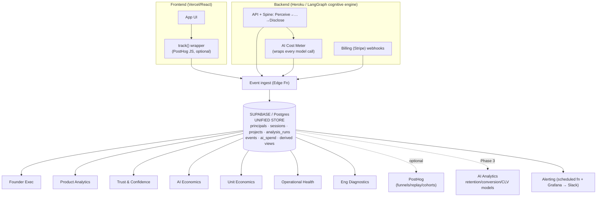
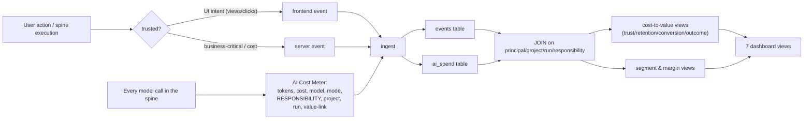
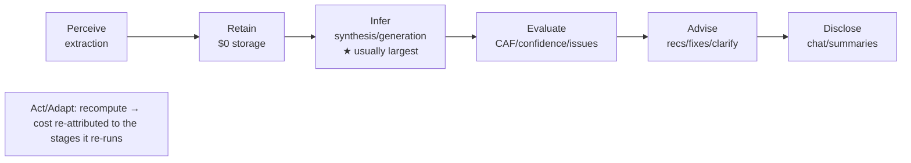
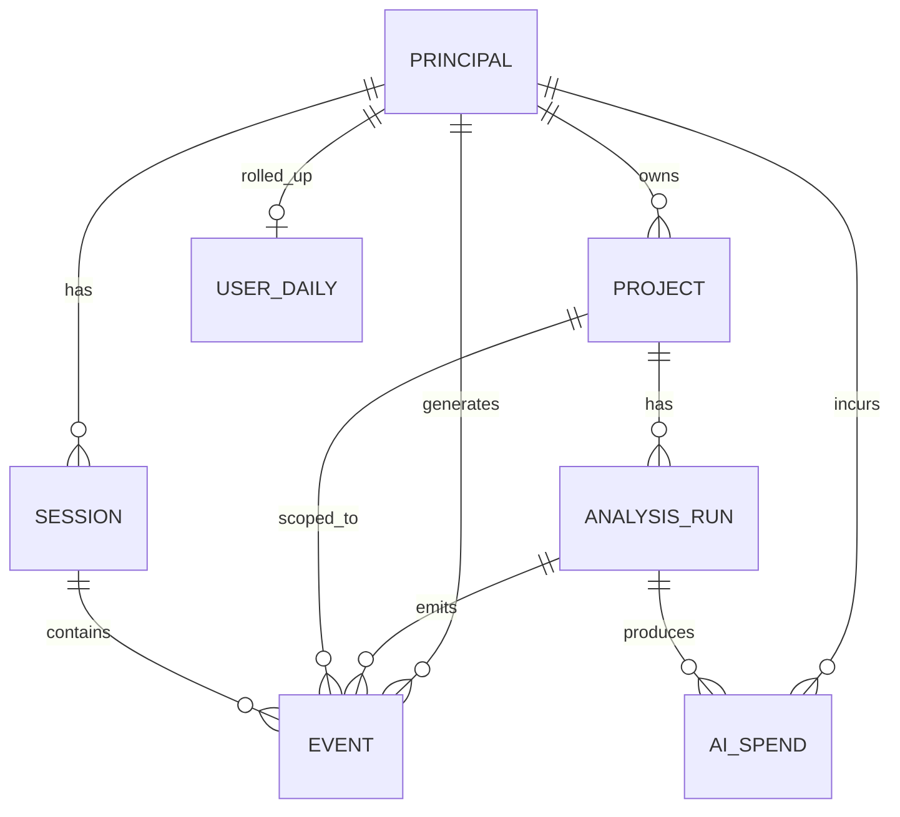
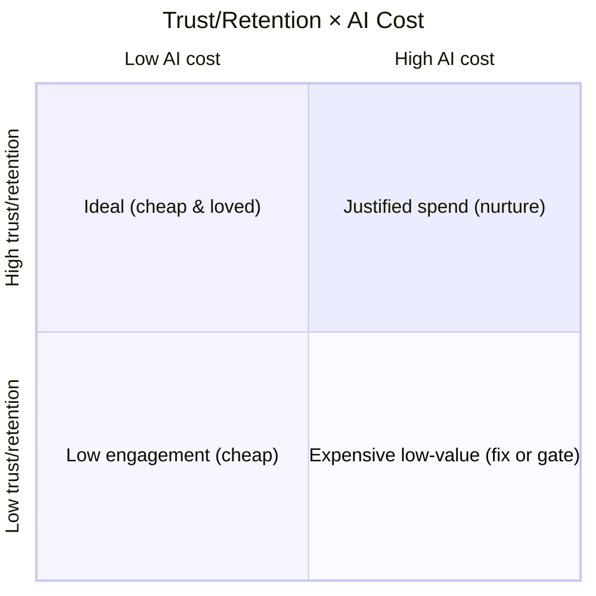

# OSLO Release 1 — Observability & Economics Platform Specification v1

**Document Type:** Unified Observability, Product-Analytics & AI-Economics Platform (implementation-ready) · **Status:** Draft for engineering handoff · **Date:** 2026-06-05
**Authoring stance:** Senior Product Analytics Architect · Staff Engineer · PM · Startup Growth Advisor.
**Supersedes:** `RELEASE_1_TELEMETRY_AND_PRODUCT_ANALYTICS_SPECIFICATION_V1` (absorbed in full — see Appendix C). **Consolidates** product analytics + behavioral telemetry + trust analytics **with** AI/LLM consumption tracking + AI cost attribution + unit economics + operational health + cost-to-value + CLV readiness into **one** platform.
**Classification:** spans **commodity product telemetry** (TEL, Category F — DL-043 J) **and** the **contracted `AI Spend Recorded` observability** obligation (DL-048). Distinct from, and complementary to, the *cognitive* Observability Governance (two-axis replay).

> **Note on inputs.** The source "AI Economics, Unit Economics & Operational Analytics Specification" was referenced but its body was not pasted; this unified spec realizes its requirements from the enumerated deliverables (cost ratios, cross-domain questions, 7 dashboard views, 20 sections) and OSLO's ratified DL-048 cost foundation. Reconcile against any source doc if one exists.

> **North star.** R1 is a freemium **validation** launch — optimize **learning, not revenue**. The defining capability of this platform is connecting **four signal families that are usually separate systems** — *behavior, trust, AI cost, and retention/conversion* — into **one joinable store**, so OSLO can ask **cross-domain** questions: *which behaviors predict conversion, which features build trust, which trust signals predict retention, which cognitive-spine responsibilities consume the most cost, and which costs are justified by trust/retention/conversion.*

---

## 0. Foundations

### 0.1 Canonical cognitive spine (authoritative — replaces the old "layers")

OSLO runtime cognition is **not** described as Context Plane / Judgement / Governance / Communication layers. Cost and behavior attribute to the **responsibility spine** (DL-043):

`Perceive → Retain → Infer → Evaluate → Advise → Disclose`, over **Act/Adapt** (recompute backbone), with **Render** a non-cognitive service and **Authority** inactive in R1.

| Responsibility | Owns | AI-cost bearing? |
|---|---|---|
| **Perceive** | intake + **source-attributed claim extraction**; no Derived cognition | **Yes** (extraction) |
| **Retain** | canonical, append-only **Attested** store | No (storage) |
| **Infer** | **Findings** + **synthesis/generation of the planning model** (Derived) | **Yes — usually the largest** (generation) |
| **Evaluate** | Issues, Confidence, Reliability, CAF, Outcome Confidence, False-Confidence, Understanding State | **Yes** |
| **Advise** | Recommendations, Clarifications, Suggested Fixes — *candidate responses only, never acts* | **Yes** |
| **Disclose** | presentation of governed outputs, incl. the **Chat** surface | **Yes** (chat/summaries) |
| **Act/Adapt** | recompute/stale backbone; re-runs the spine on qualifying change (cross-cutting) | cost **re-attributed** to the responsibilities it re-runs (no own bucket) |
| **Render** | pixel-level formatting service; owns no cognition | No |
| **Authority** | specified, **inactive in R1**; no exposure/suppression/authorization engine built | n/a (deferred R2) |

**Layer → spine translation (for the engineering team):** intake/ingestion → **Perceive** · claim extraction → **Perceive** · canonical storage → **Retain** · findings/planning-model generation → **Infer** · scoring/issue-detection/confidence → **Evaluate** · recommendations/clarifications/suggested-fixes → **Advise** · chat/summaries/governed-output presentation → **Disclose** · regeneration/stale recompute → **Act/Adapt** · formatting/report layout → **Render**.

### 0.2 Design principles
1. **One joinable store, many views.** Behavior, trust, AI cost, and outcomes share keys (`principal_id`, `project_id`, `run_id`, `responsibility`) so any signal joins to any other. **No siloed second system; no duplicated dashboards.**
2. **Buy the pipeline where free, own the schema.** Supabase (Postgres) is the canonical platform; PostHog optional for behavioral exploration. Effort goes into the **taxonomy + join keys**.
3. **Attribute every meaningful AI cost** to **user × project × workflow × cognitive-spine responsibility × value-signal.** This is the core economics requirement.
4. **Three metric tiers:** **`[C]`** collected · **`[D]`** displayed · **`[X]`** decision-grade. Executive view is *only* `[X]`; diagnostics go deep.
5. **Rich from day one, modeled later.** Full taxonomy + spend attribution at launch; predictive models in Phase 3.
6. **Connected signals, not separate systems** — trust, confidence, retention, and unit economics are read **together** (the cost-to-value ratios, §7).

### 0.3 Guardrails (OSLO-specific, non-negotiable)
- **No artifact content in telemetry** — metadata only (counts/types/sizes/tokens). User documents never enter the analytics/economics plane.
- **Internal/test accounts excluded** from all analytics **and** economics (CHG-059) — they cannot inflate trust, k-factor, conversion, or **distort cost/margin**.
- **Confidence is not probability** (Seam Audit 001 S6) — never rendered as %-likelihood; tracked as understanding maturity.
- **PII minimized** — hashed email; consent/opt-out; EU residency via self-host.
- **Identity continuity** — reviewer→user promotion (DL-049) keeps the same `principal_id`; no re-keying.

---

## 1. Unified Architecture

### 1.1 Component diagram



### 1.2 Data-flow



**The unifying mechanism: the AI Cost Meter.** A thin wrapper around **every** LLM call in the spine emits one `ai_spend` row tagged with the **responsibility** that made the call, the `project_id`/`run_id`, the `workflow`, and a **value-link** (the finding/recommendation/run it produced). Because `events` and `ai_spend` share those keys, **cost joins to behavior, trust, and outcome** — that join is the whole platform.

### 1.3 Recommended technology (Supabase-first, startup-lean)

| Layer | Recommendation | Why |
|---|---|---|
| **Canonical store** | **Supabase (Postgres)** — entities, `events`, `ai_spend`, derived SQL views, RLS | One store where behavior × trust × cost × outcome **join**; Postgres + auth + edge functions + realtime + row-level security; cheap; no warehouse needed at R1 scale. |
| Event ingest | **Supabase Edge Function** (`/ingest`) + a typed `track()` wrapper | One choke-point enforces the envelope; server-authoritative for `[X]`/cost events. |
| AI cost meter | wrapper in the model-call layer (LangGraph tool/middleware) emitting `ai_spend` | Realizes & **extends the DL-048 `AI Spend Recorded` event** with `responsibility`/`project`/`value_link`. |
| Behavioral exploration | **PostHog** (optional, Phase 1–2) fed the same events | Funnels/replay/cohorts fast; can be dropped for a pure-Supabase build. |
| Dashboards | **Metabase** (or Grafana, already in stack) on Supabase SQL | Non-technical-friendly; email/Slack subscriptions. |
| Alerting | scheduled Edge Function + Grafana → Slack `#oslo-signals` | Reuse existing Grafana. |
| Predictive *(Phase 3)* | **dbt models in Supabase** → retention/conversion/CLV | The marts are already in Postgres — no migration. |

> **Why not warehouse-first:** at validation scale Supabase Postgres handles events + spend + joins comfortably; adding ClickHouse/BigQuery/Segment now is the enterprise overengineering the brief forbids. Postgres → dbt is the linear upgrade path if volume demands it.

### 1.4 Scalability / cost / security
- **Scalability:** hundreds of users, low event volume → trivial for Postgres; partition `events`/`ai_spend` by month when they grow; PostHog/dbt are additive, not rewrites.
- **Cost:** Supabase free/Pro tier + Metabase OSS ≈ **negligible**, and **orders of magnitude below the AI inference cost it measures** (DL-048). Don't starve instrumentation to save telemetry pennies.
- **Security:** server-authoritative cost/business events; **metadata + tokens only, never artifact content**; **Supabase RLS** scopes analytics reads; hashed identity; Internal-account exclusion baked into every view; consent/opt-out.

---

## 2. Unified Event Taxonomy

Two event families, **one envelope**, **shared keys**.

### 2.1 Shared envelope
```json
{
  "event": "recommendation_accepted",
  "ts": "2026-06-05T18:22:10Z",
  "principal_id": "prn_8f3", "anonymous_id": "anon_2a",
  "is_internal": false, "tier": "free",
  "session_id": "ses_91", "project_id": "prj_55", "run_id": "run_77",
  "responsibility": "advise",          // when spine-attributable
  "properties": { /* event-specific */ },
  "source": "frontend"                 // frontend|backend|meter|webhook
}
```

### 2.2 Product-analytics events (absorbed from the prior spec)
Legend **`[C]`** collected · **`[D]`** displayed · **`[X]`** decision · **(srv)** server-authoritative.

- **Acquisition:** `signup_started` `[C]`, `signup_completed` `[C][X]`(srv), `referral_source_identified` `[C]`, `campaign_source_identified` `[C]`, `invitation_accepted` `[C][X]`(srv) — *(props incl. `loop`=crr/mri/pdf, `inviter_principal_id`)*.
- **Onboarding:** `onboarding_started/completed/skipped` `[C][D]`, `first_project_started` `[C][D]`, `first_project_abandoned` `[C]`.
- **Project:** `project_created` `[C][X]`(srv), `project_uploaded` `[C]`(srv, props `artifact_count/types/upload_size_kb/duration_s/project_type`), `project_updated/archived/deleted` `[C]`.
- **Analysis:** `analysis_started` `[C]`(srv, `mode`), `analysis_completed` `[C][X]`(srv, `duration_s/time_to_first_mri_s/confidence_score/clarity/alignment/feasibility/issue_count/recommendation_count`), `analysis_failed` `[C][X]`(srv, `failure_class/partial_returned`), `analysis_abandoned` `[C]`.
- **Score & Health:** `score_viewed` `[C][D]`, `score_expanded` `[C]`, `health_indicator_viewed` `[C]`, `confidence_details_viewed` `[C]`.
- **Issue:** `issue_viewed/expanded/accepted/rejected/ignored` `[C]`, `issue_resolved` `[C][D]` (props `severity/category/issue_type/time_to_resolution_h`).
- **Recommendation:** `recommendation_viewed` `[C][D]`, `recommendation_accepted` `[C][X]`, `recommendation_rejected` `[C]`(healthy), `recommendation_modified` `[C]`, `recommendation_regenerated` `[C]` (props `rec_type/rec_impact/rec_confidence`).
- **Trust (critical → §6):** `score_disputed` `[C][X]`, `recommendation_overridden` `[C][X]`, `regeneration_requested` `[C]`, `clarification_requested` `[C]`, `clarification_answered` `[C][D]`, `recommendation_followed` `[C][X]`, `recommendation_ignored` `[C]`.
- **Engagement:** `session_started` `[C]`, `session_ended` `[C][D]` (`session_duration_s`), `return_visit` `[C][X]` (`days_since_last`), `project_reopened` `[C]`, `export_generated` `[C][D]`.
- **Monetization (limit events = the Seam-Audit gates):** `pricing_page_viewed` `[C][D]`, `upgrade_page_viewed` `[C][D]`, `premium_feature_attempted` `[C][X]`, `project_limit_reached` `[C][X]`(srv, `up_id`=UP-3), `limit_reached` `[C][X]`(srv, `up_id/cap_type`=fix/chat/deep/budget), `upgrade_started` `[C][X]`(srv), `upgrade_completed` `[C][X]`(srv/webhook, `target_tier/days_to_convert`).
- **Collaboration (→ k-factor):** `findings_shared` `[C]`(srv,`loop=crr`), `export_shared` `[C]`, `stakeholder_invited` `[C][X]`(srv), `stakeholder_viewed` `[C]`(srv; matures R2).

### 2.3 AI cost telemetry events (the economics half — extends DL-048 `AI Spend Recorded`)

| Event | Description | Trigger | Key properties |
|---|---|---|---|
| **`ai_spend_recorded`** `[C][X]` (meter) | One row **per model call** in the spine | every LLM call (the AI Cost Meter) | `responsibility`(perceive/infer/evaluate/advise/disclose), `workflow`(extraction/synthesis/scoring/recommendation/fix/chat), `mode`(fast/deep), `model`, `tokens_in`, `tokens_out`, `est_cost_usd`, `cache_hit_ratio`, `value_link`{run_id, finding_id?, recommendation_id?} |
| `ai_budget_gate` `[C][X]` (srv) | A per-tier budget/cap gate fired (DL-048) | per-run/rollup over budget | `up_id`, `cap_type`, `action`(degrade/defer/gate), `tier` |
| `model_fallback` `[C]` (srv) | Primary→fallback model switch | OpenAI→Anthropic failover | `from_model`, `to_model`, `reason` |
| `cache_hit` `[C]` (meter) | Prompt-cache reuse (cost saver) | cached input served | `responsibility`, `tokens_saved` |
| `recompute_triggered` `[C]` (srv) | Act/Adapt re-runs the spine | qualifying change/coalesced | `trigger`(edit/fix/chat/crr/import), `coalesced_count` |

*Example `ai_spend_recorded.properties`:* `{"responsibility":"infer","workflow":"synthesis","mode":"fast","model":"gpt-4.1-mini","tokens_in":74000,"tokens_out":18000,"est_cost_usd":0.058,"cache_hit_ratio":0.4,"value_link":{"run_id":"run_77"}}`

> **DL-048 alignment / extension.** The ratified `AI Spend Recorded` event already carries tokens/cost/tier/user/mode/model. This platform **requires three additive dimensions** — `responsibility`, `project_id`/`run_id`, and `value_link` — to enable spine-attribution and cost-to-value joins. This is a **minor additive enrichment** to the contracted event (owner-ratifiable as a CHG); it changes no cognition and no epistemic invariant.

---

## 3. Cognitive-Spine Cost Attribution

Because every `ai_spend_recorded` row carries `responsibility`, AI cost rolls up by spine stage — answering *"which responsibilities consume the most AI cost"* and seeding *"which costs are justified."*



- **Attribution rule:** cost is booked to the responsibility that **made the call**. `Act/Adapt` (recompute) has **no own bucket** — a recompute re-runs Perceive…Disclose, so its tokens book to those stages (with `recompute_triggered` marking the cause). `Retain`/`Render` are ~$0 (no AI).
- **Expected R1 shape (hypothesis to validate):** **Infer** (planning synthesis/generation) is the dominant cost (input-heavy extraction + generation), then **Evaluate** and **Advise**; **Disclose/Chat** spiky per-user. The meter proves or refutes this in week one.
- **Per-call dimensions enable:** cost per responsibility, per workflow, per model, per mode (fast vs deep), per project, per user, per tier — and the **cache/fallback** savings view (optimization targets).
- **"Which AI workflows to optimize first" =** `GROUP BY workflow ORDER BY Σ est_cost_usd DESC` cross-referenced with the value-link join (high cost + low downstream trust/outcome = optimize first; high cost + high outcome = justified).

---

## 4. Unified Data Model (Supabase-ready)

### 4.1 ERD



### 4.2 Engineering-ready schema (Postgres DDL — Supabase)

```sql
-- Identity (from DL-049; same principal_id across reviewer→user promotion)
create table principal (
  principal_id text primary key,
  email_hash   text,
  type         text check (type in ('reviewer','user')) default 'user',
  tier         text check (tier in ('free','basic','pro','team','enterprise','internal')) default 'free',
  is_internal  boolean not null default false,
  lifecycle_stage text,                      -- curiosity|trust|habit|conversion|retained|dormant
  created_at   timestamptz not null default now()
);

create table session (
  session_id text primary key,
  principal_id text references principal,
  started_at timestamptz, ended_at timestamptz,
  duration_s int, device text, referrer text
);

create table project (
  project_id text primary key,
  principal_id text references principal,
  project_seq int, project_type text,
  lifecycle_state text,                       -- draft..deep_analysis_complete..archived
  artifact_count int,
  created_at timestamptz default now(), archived_at timestamptz
);

create table analysis_run (
  run_id text primary key,
  project_id text references project,
  mode text check (mode in ('fast','deep')),
  duration_s int, time_to_first_mri_s int,
  confidence_score int, clarity int, alignment int, feasibility int,
  issue_count int, recommendation_count int,
  status text                                 -- completed|failed|abandoned
);

-- Behavioral events (firehose)
create table event (
  event_id bigint generated always as identity primary key,
  event_name text not null,
  principal_id text references principal,
  anonymous_id text,
  session_id text, project_id text, run_id text,
  responsibility text,                        -- nullable; set when spine-attributable
  is_internal boolean not null default false,
  tier text, source text,
  properties jsonb not null default '{}',
  ts timestamptz not null default now()
) partition by range (ts);                    -- monthly partitions

-- AI cost (the economics core; extends DL-048 AI Spend Recorded)
create table ai_spend (
  spend_id bigint generated always as identity primary key,
  principal_id text references principal,
  project_id text, run_id text,
  responsibility text not null,               -- perceive|infer|evaluate|advise|disclose
  workflow text not null,                     -- extraction|synthesis|scoring|recommendation|fix|chat
  mode text, model text,
  tokens_in int, tokens_out int,
  est_cost_usd numeric(10,5) not null,
  cache_hit_ratio numeric(4,3),
  value_link jsonb default '{}',              -- {finding_id?, recommendation_id?}
  is_internal boolean not null default false,
  tier text,
  ts timestamptz not null default now()
) partition by range (ts);

-- Nightly rollup powering most dashboards (one row per principal per day)
create table user_daily (
  principal_id text references principal,
  day date,
  tier text, lifecycle_stage text,
  sessions int, projects_active int, analyses int,
  trust_index numeric(5,2), upgrade_intent numeric(5,2),
  ai_cost_usd numeric(10,4),                  -- attributed spend that day
  ai_cost_cum_usd numeric(12,4),              -- lifetime cumulative
  trust_outcomes int, retained boolean, converted boolean,
  primary key (principal_id, day)
);
```

**Storage strategy:** `event` + `ai_spend` are **month-partitioned** firehoses; `user_daily` is the **rollup** powering dashboards (cheap reads); entity tables (`principal/project/analysis_run`) are the app's own (read-only to analytics). **RLS:** analytics role reads all rows but **every dashboard view filters `is_internal = false`**; product surfaces use Supabase RLS scoped to the owning `principal_id`/workspace. **Retention:** firehose ≥12 mo; `user_daily` long-term (it's the CLV/feature history). **Join keys** (`principal_id`, `project_id`, `run_id`, `responsibility`) are the platform's backbone — every cross-domain view is a join on these.

---

## 5. Behavioral Funnels (the Curiosity → Trust → Habit → Conversion arc)

All funnels: Internal-excluded, 7-day step window, measured as step-CR and overall-CR.

| Funnel | Steps | Headline metric | Interpretation |
|---|---|---|---|
| **① Activation** | `signup_completed`→`first_project_started`→`analysis_completed`→`score_viewed` | **Activation Rate** (`score_viewed÷signup`) | proves first value lands; drop-step localizes friction. Target ≥40%. |
| **② Trust** | `score_viewed`→`recommendation_viewed`→`recommendation_accepted`→`recommendation_followed` | **follow-through** (`followed÷viewed`) | belief forming; rejection is **healthy**, disputes/overrides are the breakers. |
| **③ Habit** | project 1→project 2→`return_visit`→weekly-active | **Second-Project Rate** | strongest PMF signal; novelty vs habit. |
| **④ Conversion** | free→`limit_reached`/`premium_feature_attempted`→`pricing/upgrade_viewed`→`upgrade_completed` | **limit→pricing** & **pricing→upgrade** | R1 = *intent shape*, not revenue; feeds Upgrade-Intent. |

Visualization: PostHog funnels (or Metabase funnel on `event`), trended over time, broken down by tier/source/cohort.

---

## 6. Trust Index

Composite **0–100** per active user (trailing 30d), averaged for the headline. Positive weights 0.75, negative 0.25 (trust is harder to build than lose; healthy rejection excluded).

```
TrustIndex = 100 × clamp(
    0.30·FollowThrough + 0.20·AcceptanceRate + 0.15·ClarificationEngage + 0.10·ReturnAfterRec
  − 0.15·DisputeRate − 0.07·OverrideRate − 0.03·ExcessRegenRate , 0, 1)
```
🟢≥70 trustworthy · 🟡50–70 provisional · 🔴<50 trust failure (**stop-the-line** — a product/calibration issue, not a growth one). **Weights are starting hypotheses — validate against retention/conversion, then re-weight** (track-and-learn).

---

## 7. Cost-to-Value Ratios *(the unification — AI economics × product/trust signals)*

These ratios are **only possible** because `ai_spend` and `event` share keys. They answer *"which AI costs are justified."* All Internal-excluded, computed per cohort and per segment.

| Ratio | Formula | Reads as | Healthy direction |
|---|---|---|---|
| **Cost-to-Trust** | `Σ ai_spend.est_cost_usd (cohort) ÷ trust_outcomes` where trust_outcomes = `recommendation_followed + clarification_answered` | **$ per trusted action** | ↓ (cheaper to earn trust) |
| **Cost-to-Retention** | `Σ ai_spend (cohort) ÷ retained_users(D30)` | **$ to retain a user** | ↓ |
| **Cost-to-Conversion** | `Σ ai_spend of converters (pre-conversion) ÷ converters` | **AI-CAC** (AI cost of acquiring a paying user) | ↓ |
| **Cost-to-Outcome** | `Σ ai_spend ÷ adopted_outcomes` where adopted = `recommendation_accepted + recommendation_followed + issue_resolved` | **$ per delivered understanding-improvement** (most OSLO-native) | ↓ |

**Interpretation guidance:** these are **diagnostic, not targets, in R1** — the goal is to learn *the shape*. The decisive cross-tab is **cost-by-responsibility/workflow ÷ value**: e.g. if **Infer** is 60% of spend and correlates with high trust + retention → **justified**; if **Disclose/Chat** is 25% of spend with weak trust correlation → **optimization target** (cheaper routing, tighter caps). This is how the platform answers *"which AI workflows to optimize first"* and *"which costs are justified by trust/retention/conversion."*

---

## 8. Unit Economics

### 8.1 Per-unit cost & margin (vs DL-048 budgets)
- **Cost/user/month** by tier from `ai_spend` (Internal-excluded), compared to the DL-048 ceilings: **Free ≈ $3**, **Basic ≈ $8** (cap $7.90), Pro/Team/Enterprise = R2.
- **Cost/active-project** and **cost/analysis-run** (fast vs deep) — from `ai_spend` ÷ `project`/`analysis_run`.
- **Contribution margin/user** = `tier_revenue − ai_cost_cum − infra`. **Free users carry negative margin = the deliberate CAC subsidy** (bounded by DL-048). Paid margin = price − serving cost.

### 8.2 Segment matrix (answers "expensive low-value" vs "high-trust high-retention")



- **Q2 cheap & high-trust** → the target customer; learn what they do (golden path).
- **Q1 expensive but high-trust/retention** → **justified**; optimize cost (routing/caching) without harming value.
- **Q4 expensive & low-trust** → the danger segment; tighten caps (DL-048), fix quality, or let churn — the literal *"expensive but low-value"* answer.
- **Q3 cheap & low-engagement** → harmless; activation problem, not a cost one.

Built as a Supabase view joining `user_daily.trust_index` × `ai_cost_cum_usd` × `retained`.

---

## 9. CLV Readiness Model

R1 doesn't compute CLV; it **makes CLV computable later** by capturing the margin-aware feature vector now.

- **Readiness = the `user_daily` feature history:** per-user tier, lifecycle stage, retention status, Trust Index, Upgrade-Intent, **cumulative AI cost**, contribution margin — the exact inputs a CLV/retention/conversion model needs (Phase 3), with **no re-instrumentation**.
- **Margin-aware CLV (Phase 3 form):** `CLV ≈ (expected_tier_revenue × expected_retention_months) − cumulative_ai_cost − infra`. For free users CLV is **negative by accumulated AI cost** until conversion — making *"which behaviors predict future CLV"* a question of *which free behaviors predict conversion at acceptable accumulated cost*.
- **Lifecycle stages** (states, north-star arc): **Visitor → Curiosity → Trust → Habit → Conversion → Retained/Advocate** (+ **Dormant**), entry criteria per the prior spec; `user_daily.lifecycle_stage` updated nightly. Stage × cumulative-cost × trust is the CLV-readiness grid.

---

## 10. Unified Dashboard Model — 7 Audience Views

**One metric, one home.** Views are *audience lenses* over the same store — no metric is duplicated; a metric appears in the view that owns the decision, and is *referenced* (not recomputed) elsewhere.

| View | Audience | Purpose | Headline metrics | Tier |
|---|---|---|---|---|
| **1. Founder Executive** | Founder | "is R1 working?" — one screen | Activation Rate, D7/D30 Retention, Second-Project Rate, Recommendation Adoption, **Trust Index**, **blended cost/active-user vs DL-048 budget**, Free→Paid (track-only) | **`[X]` only** |
| **2. Product Analytics** | PM | behavior & funnels | the 4 funnels, cohorts, paths, feature adoption, retention-by-behavior | `[D]` |
| **3. Trust & Confidence** | PM/Founder | OSLO's defining question | Trust Index + sub-metrics (accept/reject/override/dispute/regen/clarify), confidence trend (never as probability) | `[D]`/`[X]` |
| **4. AI Economics** | Founder/Eng | where the money goes | **cost by cognitive-spine responsibility**, by workflow, by model/mode; cache/fallback savings; cost/run; budget-gate rate | `[D]`/`[X]` |
| **5. Unit Economics** | Founder | margin & segments | cost/user/tier vs budget, contribution margin, the **trust×cost segment matrix**, the **4 cost-to-value ratios** | **`[X]`** |
| **6. Operational Health** | Eng/PM | is it healthy & fast | analysis success/fail rate, Time-to-First-MRI p50/p95 (DL-046 60s gate), degradation/gate events, model-fallback rate, recompute/coalescing | `[D]`/`[X]` |
| **7. Engineering Diagnostics** | Eng | deep investigation | raw event/spend explorer, per-run token traces, failure drill-down, instrumentation-health, partition/volume | `[C]` deep |

> Cost-to-value ratios live in **View 5 (Unit Economics)**; cost-by-responsibility lives in **View 4 (AI Economics)**; trust lives in **View 3** — the Founder view (1) shows only the decision-grade roll-ups and links into the others. No recomputation, no duplication.

## 11. Cross-Domain Question → Answer Map

The platform's reason to exist: every question is a **join**, not a new system.

| Question | View | How (join) |
|---|---|---|
| Which behaviors predict conversion? | 2 + 5 | `event` behavior cohorts → `upgrade_completed`; logistic signal (Phase 3) |
| Which features generate the most trust? | 3 | feature `event` usage → subsequent Trust-Index delta |
| Which trust signals predict retention? | 3 + 2 | trust events → `return_visit`/D30 retention correlation |
| Which spine responsibilities consume the most AI cost? | 4 | `ai_spend GROUP BY responsibility` |
| Which AI costs are justified by trust/retention/conversion? | 4 + 5 | `ai_spend` (by responsibility/workflow) ⋈ trust/retention/conversion outcomes → cost-to-value ratios |
| Which workflows produce the highest-margin customers? | 5 | `ai_spend.workflow` ⋈ `user_daily` contribution margin |
| Which product behaviors indicate future CLV? | 5 + 9 | behavior cohorts → `user_daily` margin/retention trajectory |
| Which AI workflows to optimize first? | 4 | high `Σ est_cost_usd` ⋈ low downstream outcome (value_link) |
| Which segments are expensive but low-value? | 5 | segment matrix Q4 (`ai_cost_cum` high × trust/retention low) |
| Which segments are high-trust & high-retention? | 5 | segment matrix Q2 |

## 12. Alerting Framework

Daily scheduled Edge Function (+ Grafana) → Slack `#oslo-signals`; each alert names an action.

| Alert | Threshold | Escalation | Action |
|---|---|---|---|
| Activation decline | <25% or −10pp WoW | PM→Founder | inspect funnel drop-step + `analysis_failed` + Time-to-First-MRI |
| Retention decline | D7 −5pp / D30 −3pp | PM→Founder | per-behavior retention; interview lapsed activated |
| Trust decline | Trust Index −5 WoW or <50 | Founder (stop-the-line) | dispute/override spike by project type — product/calibration |
| Analysis failures | fail >5% or p95 Time-to-First-MRI >60s (DL-046) | Eng on-call | engine logs, budget gating, envelope; confirm graceful degradation |
| **AI cost spike** | cost/active-user >1.5× DL-048 budget, or daily AI $ +40% DoD | **Founder+Eng** | which responsibility/workflow drove it; check fallback/cache; tighten caps (Calibration §4c) |
| **Margin breach** | any tier serving-cost > price (paid) or Free cost/user > ceiling | Founder | re-route to cheaper model class; cap depth; segment Q4 review |
| Conversion-signal decline | `limit_reached→pricing` −10pp | PM | are limits binding on value? is the UP prompt surfacing (Seam Audit 001)? |
| Instrumentation health | event/spend volume −30% DoD | Eng on-call | SDK/meter broken — fix before trusting any metric |

## 13. Release 1 Implementation Plan & Rollout

Effort in engineer-days (one dev + Claude Code); **P0 = launch-blocking**.

### Phase 1 — Launch (minimum viable observability + economics) · ~7–10 days
**Scope:** Supabase store (entity + `event` + `ai_spend` + `user_daily`); typed `track()` wrapper + `/ingest` edge fn; **the AI Cost Meter wrapping every spine model call** (responsibility-tagged) — *this is the non-negotiable economics foundation*; the `[X]` decision events; Internal-exclusion in every view; **Founder Executive (View 1)** + **AI Economics (View 4, cost-by-responsibility)** + **Trust Index v0** + Operational Health basics; core alerts incl. AI-cost-spike + margin-breach.
**User stories:** *founder* sees activation/retention/trust **and** cost/active-user vs budget on one screen; *eng* sees cost by cognitive-spine responsibility from day one; every model call is metered and attributable.
**Technical tasks (P0):** schema + partitions; `track()` + enum; server emitters for `[X]` events; **AI Cost Meter** emitting `ai_spend_recorded` w/ `responsibility/workflow/value_link` (extends DL-048); `user_daily` nightly rollup; Metabase Views 1/4 + Trust v0; 4 product + 2 economics alerts; confidence-as-probability label lint.
**Don't ship without:** the Cost Meter (responsibility attribution), Internal-exclusion, Activation funnel, Trust Index v0, cost/active-user vs budget.

### Phase 2 — 30 Days (behavioral + economics depth) · ~6–9 days
**Scope:** full taxonomy (`[C]`); Views 2/3/5/6 complete; the **4 cost-to-value ratios** + **segment matrix**; cohort/path/per-behavior retention; PostHog (optional) for replay on drop paths; Upgrade-Intent + Lifecycle; k-factor per loop (TEL-06/P6). **Re-calibrate Trust Index, funnel thresholds, and the cost ratios from real baseline.**
**Priority:** P1.

### Phase 3 — 60–90 Days (predictive + AI analytics) · ~10–14 days
**Scope:** dbt models in Supabase → **retention, conversion/upgrade, margin-aware CLV** predictions; AI-driven journey/anomaly summaries; automated *"high-intent / expensive-low-value / at-risk"* segment lists. Reuses the `user_daily` feature vector — no re-instrumentation.
**Priority:** P2 (gated on enough data to model).

## 14. Recommended Implementation Approach

1. **Supabase-first, one store.** Don't add a warehouse/CDP at R1 — Postgres holds events, spend, and the joins. dbt-in-Supabase is the only future structural step.
2. **Meter before you build dashboards.** The AI Cost Meter is the keystone; once every spine call emits a responsibility-tagged `ai_spend` row, every economics view is a query. Build it in Phase 1, week 1.
3. **Rollup table = speed + simplicity.** `user_daily` powers ~all dashboards cheaply and *is* the CLV feature store — design it once, reuse forever.
4. **Track-and-calibrate.** Ship Trust Index, ratios, and thresholds as **hypotheses**; calibrate against real cohorts in Phase 2 before any are decision-binding. (Same discipline as the k-factor target and DL-048 defaults.)
5. **Keep the executive view ruthless.** View 1 is `[X]`-only; resist adding diagnostics to it — depth lives in Views 2–7.

---

## Appendix A — Metric tiers (collected / displayed / decision)
- **`[X]` Decision (Founder View 1 + Unit-Economics View 5):** Activation, D7/D30 Retention, Second-Project, Recommendation Adoption, **Trust Index**, **cost/active-user vs budget**, the **4 cost-to-value ratios**, Free→Paid (track-only).
- **`[D]` Displayed (Views 2/3/4/6):** funnels, cohorts, feature adoption, trust sub-metrics, cost-by-responsibility/workflow/model, operational health.
- **`[C]` Collected (everything):** full §2 taxonomy + `ai_spend` firehose; surfaced as needed (View 7).

## Appendix B — Mapping to existing canon
| Existing | Realized/extended by |
|---|---|
| **DL-048 `AI Spend Recorded`** | `ai_spend_recorded` event + `ai_spend` table — **extended** with `responsibility`/`project`/`run`/`value_link` (additive; CHG-worthy) |
| DL-046 60s gate | Operational Health view (Time-to-First-MRI p50/p95) |
| DL-049 `Principal` | `principal` identity; continuity across reviewer→user |
| Calibration §4c/§4f | budgets/ceilings the Unit-Economics view measures against; k-factor |
| Seam Audit 001 | `limit_reached`/`ai_budget_gate` events |
| TEL-01…07 | absorbed (Appendix A of the prior spec) |
| CHG-059 Internal | `is_internal` exclusion everywhere |

## Appendix C — Supersession
This document **supersedes** `RELEASE_1_TELEMETRY_AND_PRODUCT_ANALYTICS_SPECIFICATION_V1` (its product-analytics content is absorbed §2/§5/§6 + Appendix A). The prior file is bannered as superseded; this is the single canonical observability + economics spec.

---
*This unified specification consolidates OSLO's Release 1 product analytics, behavioral telemetry, trust analytics, AI/LLM consumption tracking, AI cost attribution, unit economics, operational health, cost-to-value analysis, and CLV readiness into a single Supabase-centric platform whose defining capability is a shared-key store where behavior, trust, AI cost, and outcomes join. It restates OSLO's runtime as the canonical cognitive spine (Perceive→Retain→Infer→Evaluate→Advise→Disclose, Act/Adapt cross-cutting, Render non-cognitive, Authority deferred) with a layer→spine translation, and attributes every AI cost — via an AI Cost Meter extending the ratified DL-048 AI Spend Recorded event — to user, project, workflow, cognitive-spine responsibility, and value signal. It defines a unified event taxonomy and engineering-ready Supabase schema, the four behavioral funnels, the Trust Index, four cost-to-value ratios (Cost-to-Trust/Retention/Conversion/Outcome), unit-economics margin and a trust×cost segment matrix, a CLV-readiness feature vector, seven non-duplicating audience dashboard views, a cross-domain question→join map, a merged alerting framework with AI-cost and margin alerts, and a three-phase rollout from a launch-blocking meter to predictive analytics — bound throughout by OSLO guardrails (no artifact content, Internal accounts excluded, Confidence never as probability, identity continuity) and the principle that trust, confidence, retention, and unit economics are connected signals read together.*

**OSLO Release 1 Observability & Economics Platform Specification v1 complete.**
