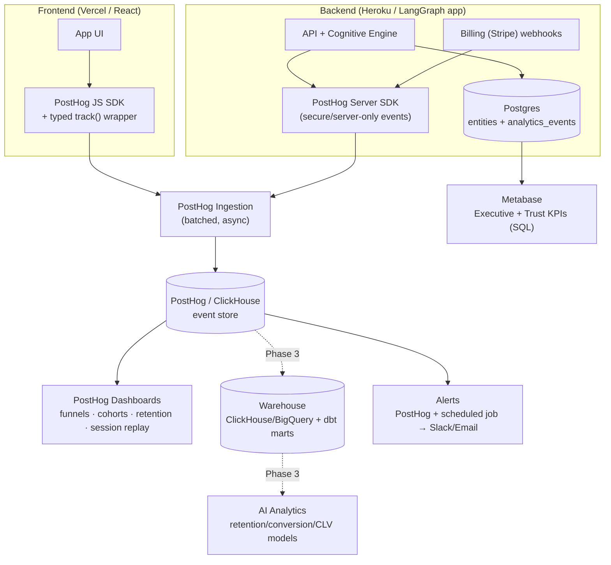
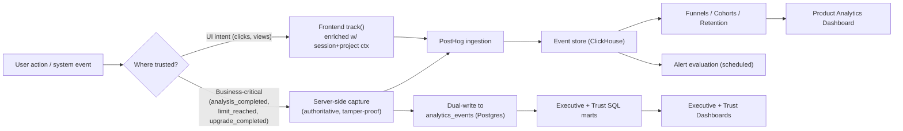
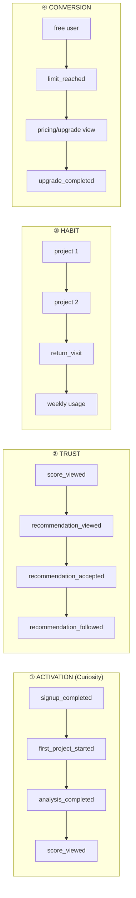
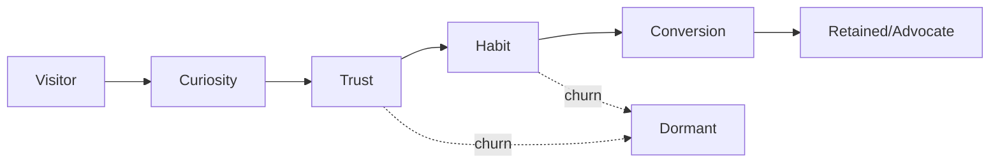
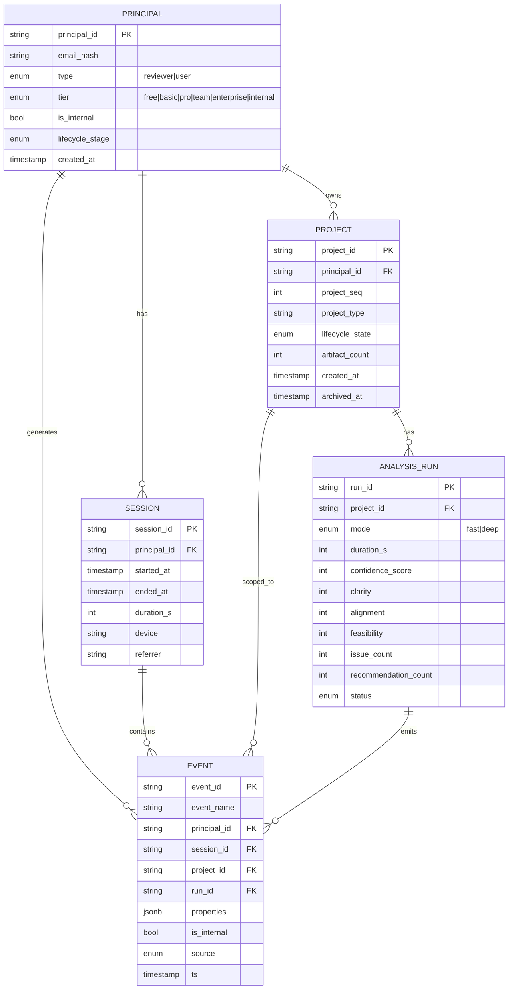

# Release 1 — Telemetry & Product Analytics System Specification v1

**Document Type:** Product/Business Telemetry & Analytics Spec (implementation-ready) · **Status:** Draft for engineering handoff · **Date:** 2026-06-05
**Authoring stance:** Senior Product Analytics Architect · Staff Engineer · PM · Startup Growth Advisor.
**Classification:** **Commodity product telemetry (TEL, Category F — DL-043 J).** This is **distinct from** the contracted *cognitive* Observability Governance (two-axis replay of governed cognition); that system is unchanged and not duplicated here. This spec instruments **user/business behavior** and **realizes + extends the existing `TEL-01…07` capabilities**.

> **North star.** R1 is a freemium **validation** launch — the objective is **learning, not revenue**. Everything here optimizes one question: *which behaviors move a user along* **Curiosity → Trust → Habit → Conversion**. The four behavioral funnels (§3) and the lifecycle model (§7) are that arc made measurable.

---

## 0. Principles, scope & guardrails

**Design principles (startup-grade):**
1. **Buy the pipeline, build the taxonomy.** Don't hand-roll an event pipeline/dashboard stack. Adopt a product-analytics platform (PostHog, §1.3) and invest engineering effort in a **clean, typed event taxonomy** (§2) — that's the durable asset.
2. **Rich from day one, modeled later.** Capture the full taxonomy at launch; defer the warehouse/modeling/AI layer to Phase 3. Cheap to over-collect events; expensive to back-fill history you never captured.
3. **Three metric tiers (constraint 8).** Every metric is tagged: **`[C]` Collected** (instrumented) · **`[D]` Displayed** (on a dashboard) · **`[X] Decision`** (drives executive decisions). Most events are `[C]`; few are `[X]`. The Executive Dashboard (§4) is *only* `[X]`.
4. **Identity-stitched, journey-reconstructable.** Every event keys to a stable **`Principal` id** (DL-049) so anonymous→signup→user journeys stitch cleanly and future cohort/CLV modeling is possible.
5. **Trust is a first-class metric, not a vibe.** OSLO's whole thesis is trustworthy understanding; §6 makes trust a measured composite.

**Hard guardrails (OSLO-specific — non-negotiable):**
- **No artifact content in telemetry — ever.** Events carry **metadata only** (artifact_count, types, sizes, durations). The user's documents are sensitive IP; they never enter the analytics plane.
- **Internal/test accounts excluded** from all analytics (CHG-059) — they cannot inflate activation, trust, k-factor, or conversion. Every query and dashboard filters `is_internal = false`.
- **Confidence is not probability** (Seam Audit 001 S6). Analytics labels/dashboards **never** render the 0–100 Confidence as a %-likelihood or "win probability." Track it as *understanding maturity*, not odds.
- **PII minimized.** Email is **hashed** at the identity layer; no raw PII in event properties. Consent/opt-out honored; EU data residency available via self-host.

---

## 1. Telemetry Architecture

### 1.1 Component diagram



### 1.2 Data-flow diagram



**Instrumentation split (who emits what):**
- **Frontend (PostHog JS, autocapture OFF for precision; explicit `track()` only):** all *intent/UI* events — page/score/issue/recommendation views and expansions, onboarding steps, pricing/upgrade page views, clarification UI. Enriched with session + project context automatically by a thin wrapper.
- **Backend (PostHog server SDK + dual-write to Postgres):** all *authoritative/business-critical or security-sensitive* events — `analysis_started/completed/failed`, `project_*` lifecycle, `*_limit_reached` (the 429/422 gate moments, §2 + Seam Audit 001), `upgrade_completed` (from billing webhook, never client-trusted), `invitation_accepted`. Server-side = can't be spoofed and survives ad-blockers.

### 1.3 Recommended technology (startup-optimized)

| Layer | Recommendation | Why (vs alternatives) |
|---|---|---|
| Product analytics core | **PostHog** (Cloud free tier → self-host for EU/residency) | Events + funnels + cohorts + retention + **session replay** + feature flags + dashboards out-of-the-box. 1M events/mo free. Kills the build-it-yourself temptation. (vs Amplitude/Mixpanel: PostHog is cheaper, self-hostable, replay included; vs Segment: PostHog ingests directly — no separate CDP needed at this scale.) |
| Frontend SDK | PostHog JS + a **typed `track(event, props)` wrapper** enforcing §2 schema | One choke-point guarantees schema conformance; no rogue events. |
| Backend SDK | PostHog Python/Node SDK | Server-authoritative events. |
| In-app event mirror | **Postgres `analytics_events`** (dual-write of business-critical events) | SQL access for the Executive/Trust marts without round-tripping PostHog; the warehouse seed. |
| Executive/Trust dashboards | **Metabase** on Postgres | Fast SQL dashboards + email/Slack subscriptions; non-technical-friendly. |
| Product/behavioral dashboards | **PostHog** native | Funnels/cohorts/retention are first-class. |
| Alerting | PostHog alerts + a **scheduled job** (or existing **Grafana**) → Slack/email | Reuse the OTel/Grafana already in the stack for threshold alerts. |
| Warehouse + modeling *(Phase 3)* | **ClickHouse or BigQuery + dbt** | Modeled marts = the feature store for AI analytics; deferred until there's data worth modeling. |

> **Separation of concerns:** **OpenTelemetry/Grafana** (already in the stack) stays for **system/cognitive observability** (latency, the two-axis replay, AI-spend per DL-048). **PostHog** owns **product/business behavior**. Don't conflate them — different questions, different audiences.

### 1.4 Scalability, cost, security

- **Scalability:** at validation scale (hundreds of users, ~tens of events/session) volume is trivial — well inside PostHog's free tier and a single Postgres. PostHog/ClickHouse scales to billions of events with no architecture change; the warehouse split (Phase 3) is the only future structural step. **Batched, async ingestion** means telemetry never blocks the user path or the 60s Time-to-First-MRI.
- **Cost:** effectively **$0** at R1 scale (PostHog free ≤1M events/mo; Metabase OSS; Grafana already present). Telemetry cost is **negligible next to AI inference** (DL-048) — do not let analytics caution starve instrumentation. Phase-3 warehouse cost is opt-in when volume justifies it.
- **Security:** server-side capture for business/security events; **metadata-only** (no artifact content); **hashed identity**; **Internal-account exclusion**; tenant/workspace scoping respected; consent + opt-out; EU self-host option. Telemetry inherits the platform's RBAC; analytics access is least-privilege.

---

## 2. Canonical Event Taxonomy

### 2.1 Shared event envelope (every event)

```json
{
  "event": "recommendation_accepted",
  "timestamp": "2026-06-05T18:22:10Z",
  "principal_id": "prn_8f3...",          // stable identity (DL-049)
  "anonymous_id": "anon_2a...",          // pre-signup; stitched on signup
  "is_internal": false,                   // CHG-059 — excluded from analytics if true
  "tier": "free",                         // free|basic|pro|team|enterprise|internal
  "user_context":    { "principal_id":"prn_8f3...", "tier":"free", "account_age_days": 3, "lifecycle_stage":"trust" },
  "session_context": { "session_id":"ses_91...", "session_seq": 4, "device":"desktop", "referrer":"posthog_attr" },
  "project_context": { "project_id":"prj_55...", "project_seq": 1, "lifecycle_state":"deep_analysis_complete" },
  "properties":      { /* event-specific — see below */ },
  "source": "frontend"                    // frontend|backend|webhook
}
```

*User/Session/Project context is attached automatically by the `track()` wrapper (frontend) or the server emitter (backend). Only `properties` differ per event. Example payloads below show `properties` only.*

### 2.2 Categories & events

Legend: **`[C]`** collected · **`[D]`** displayed · **`[X]`** decision-grade · **(srv)** server-authoritative.

#### A. Acquisition
| Event | Description | Trigger | Key properties |
|---|---|---|---|
| `signup_started` `[C]` | User begins account creation | Auth/signup form opened | `method`(email/sso), `entry_point` |
| `signup_completed` `[C][X]` (srv) | Account created | Verified account persisted | `method`, `time_to_complete_s` |
| `referral_source_identified` `[C]` | Inbound attributed to a referrer | First touch w/ referral param | `referrer_principal_id`, `loop`(crr/mri/pdf) |
| `campaign_source_identified` `[C]` | UTM/campaign attributed | First touch w/ UTM | `utm_source/medium/campaign` |
| `invitation_accepted` `[C][X]` (srv) | Invited stakeholder joins | Reviewer/User activates from invite | `inviter_principal_id`, `loop`, `invite_age_h` |

*Example `invitation_accepted.properties`:* `{"inviter_principal_id":"prn_22","loop":"crr","invite_age_h":6}`

#### B. Onboarding
| Event | Description | Trigger | Key properties |
|---|---|---|---|
| `onboarding_started` `[C]` | First-run flow begins | Post-signup land | `variant` |
| `onboarding_completed` `[C][D]` | Flow finished | Reaches workspace/first project | `steps_completed`, `duration_s` |
| `onboarding_skipped` `[C]` | User skips | Skip control | `step_skipped_at` |
| `first_project_started` `[C][D]` | First project create begun | Create Project (1st) | — |
| `first_project_abandoned` `[C]` | Abandoned before value | Exits before analysis w/ no return in session | `last_step` |

#### C. Project *(aligns with API `project_created` etc.)*
| Event | Description | Trigger | Key properties |
|---|---|---|---|
| `project_created` `[C][X]` (srv) | Project container created | `POST /projects` 201 | `project_seq` |
| `project_uploaded` `[C]` (srv) | Artifacts ingested | Artifact(s) added | `artifact_count`, `artifact_types[]`, `upload_size_kb`, `upload_duration_s`, `project_type?` |
| `project_updated` `[C]` | Project edited | Metadata/artifact change | `change_type` |
| `project_archived` `[C]` | Archived (reversible) | Archive action | `active_age_days` |
| `project_deleted` `[C]` | Deleted | Delete action | `reason?` |

*Example `project_uploaded.properties`:* `{"artifact_count":7,"artifact_types":["pdf","docx","md"],"upload_size_kb":2480,"upload_duration_s":9,"project_type":"product_plan"}`

#### D. Analysis *(aligns with API `fast_pass_completed`)*
| Event | Description | Trigger | Key properties |
|---|---|---|---|
| `analysis_started` `[C]` (srv) | Fast/Deep pass begins | Analyze/recompute | `mode`(fast/deep) |
| `analysis_completed` `[C][X]` (srv) | Pass completes | Orientation/Deep complete | `mode`, `duration_s`, `time_to_first_mri_s`, `confidence_score`, `clarity`,`alignment`,`feasibility`, `issue_count`, `recommendation_count` |
| `analysis_failed` `[C][X]` (srv) | Pass errored | Error/timeout | `mode`, `failure_class`, `partial_returned`(bool) |
| `analysis_abandoned` `[C]` | User leaves mid-pass | Navigates away before complete | `mode`, `elapsed_s` |

*Example `analysis_completed.properties`:* `{"mode":"fast","duration_s":31,"time_to_first_mri_s":31,"confidence_score":62,"clarity":58,"alignment":64,"feasibility":61,"issue_count":11,"recommendation_count":7}`
*(Note: `confidence_score` is **understanding maturity**, never rendered as probability — guardrail §0.)*

#### E. Score & Health
| Event | Description | Trigger | Key properties |
|---|---|---|---|
| `score_viewed` `[C][D]` | MRI/score surface seen | MRI/overview render | `confidence_score`, `clarity`,`alignment`,`feasibility` |
| `score_expanded` `[C]` | Drills into score detail | Expand control | `dimension` |
| `health_indicator_viewed` `[C]` | Understanding indicator seen | Card render | `state` |
| `confidence_details_viewed` `[C]` | Confidence explainability opened | Explain control | `reliability_band` |

#### F. Issue
| Event | Description | Trigger | Key properties |
|---|---|---|---|
| `issue_viewed` `[C]` | Issue seen | Issue panel render | `severity`, `category`, `issue_type` |
| `issue_expanded` `[C]` | Issue opened | Expand | `severity` |
| `issue_accepted` `[C]` | User agrees w/ issue | Accept | `severity`, `category` |
| `issue_rejected` `[C]` | User disagrees | Reject | `severity`, `reason?` |
| `issue_resolved` `[C][D]` | Issue weakened/closed **via reanalysis** | Reanalysis clears it | `time_to_resolution_h`, `severity` |
| `issue_ignored` `[C]` | Dismissed without action | Ignore/dismiss | `severity` |

#### G. Recommendation
| Event | Description | Trigger | Key properties |
|---|---|---|---|
| `recommendation_viewed` `[C][D]` | Rec seen | Rec panel render | `rec_type`, `rec_impact`, `rec_confidence` |
| `recommendation_accepted` `[C][X]` | User accepts | Accept | `rec_type`, `rec_impact` |
| `recommendation_rejected` `[C]` | User rejects (**healthy** — OSLO advises) | Reject | `rec_type`, `reason?` |
| `recommendation_modified` `[C]` | User edits before applying | Modify | `rec_type` |
| `recommendation_regenerated` `[C]` | User asks for a new rec | Regenerate | `rec_type`, `regen_index` |

#### H. Trust *(critical — feeds the Trust Index §6)*
| Event | Description | Trigger | Key properties |
|---|---|---|---|
| `score_disputed` `[C][X]` | User flags the score as wrong | Dispute control | `dimension`, `confidence_score` |
| `recommendation_overridden` `[C][X]` | User acts **against** a rec | Override | `rec_type`, `rec_impact` |
| `regeneration_requested` `[C]` | Asks OSLO to redo (ambiguous signal) | Regenerate | `target`(score/rec), `regen_index` |
| `clarification_requested` `[C]` | OSLO asks the user to clarify | OSLO clarification prompt shown | `topic` |
| `clarification_answered` `[C][D]` | User engages the clarification | User answers | `topic`, `latency_s` |
| `recommendation_followed` `[C][X]` | Accepted rec → corresponding artifact change | Edit traced to an accepted rec | `rec_type`, `lag_h` |
| `recommendation_ignored` `[C]` | Viewed, never acted on (decayed) | No action within window | `rec_type` |

#### I. Engagement
| Event | Description | Trigger | Key properties |
|---|---|---|---|
| `session_started` `[C]` | Session opens | App focus / first event | `referrer` |
| `session_ended` `[C][D]` | Session closes | Inactivity/close | `session_duration_s`, `events_in_session` |
| `return_visit` `[C][X]` | User returns on a later day | Session on a new calendar day | `days_since_last`, `return_index` |
| `project_reopened` `[C]` | Existing project re-entered | Open existing project | `project_age_days` |
| `export_generated` `[C][D]` | PDF/export produced | Export action | `format`(pdf), `surface`(mri/artifact) |

#### J. Monetization *(the limit events ARE the §-Seam-Audit gate moments)*
| Event | Description | Trigger | Key properties |
|---|---|---|---|
| `pricing_page_viewed` `[C][D]` | Pricing seen | Pricing route | `entry_point` |
| `upgrade_page_viewed` `[C][D]` | Upgrade/checkout seen | Upgrade route | `from_prompt?`(UP-id) |
| `premium_feature_attempted` `[C][X]` | Tries a gated capability | Gated affordance used | `feature`, `tier_required` |
| `project_limit_reached` `[C][X]` (srv) | 2nd active project attempt gated | `POST /projects` → 422 (UP-3) | `up_id`:"UP-3" |
| `limit_reached` `[C][X]` (srv) | Any cap gate (fix/chat/deep/budget) | 429/DL-048 gate (UP-1/2/5/6) | `up_id`, `cap_type`(fix/chat/deep/budget) |
| `upgrade_started` `[C][X]` (srv) | Checkout begun | Checkout init | `target_tier`, `from_up_id?` |
| `upgrade_completed` `[C][X]` (srv, webhook) | Paid conversion | Billing webhook | `target_tier`, `days_to_convert` |

*Example `limit_reached.properties`:* `{"up_id":"UP-1","cap_type":"fix"}` — emitted at the server gate; pairs with the upgrade prompt the user then sees (Seam Audit 001 shared rule).

#### K. Collaboration *(feeds k-factor §3/§6 + virality TEL-06)*
| Event | Description | Trigger | Key properties |
|---|---|---|---|
| `findings_shared` `[C]` (srv) | "Share for Review" a finding (CRR) | CRR created | `loop`:"crr", `finding_severity` |
| `export_shared` `[C]` | Shared artifact/MRI link created | Share link created | `loop`(mri/pdf), `link_type`(public/private) |
| `stakeholder_invited` `[C][X]` (srv) | Reviewer invited | Invite sent | `loop`, `invite_channel` |
| `stakeholder_viewed` `[C]` (srv) | Invited recipient views (R2 surface) | Recipient opens shared item | `loop`, `inviter_principal_id` |

*(`stakeholder_viewed`/`invitation_accepted` mature in R2 with the recipient experience (CHG-064); R1 still emits `*_shared`/`*_invited` so the loop is measured from launch.)*

---

## 3. Behavioral Funnel Design

The four funnels **are** the Curiosity → Trust → Habit → Conversion arc. All funnels: **Internal-excluded**, identity-stitched, with a **7-day default conversion window** between steps (configurable), measured as **% of the prior step** (step CR) and **% of funnel entry** (overall CR).



| Funnel | Steps | Calculation | Interpretation guidance |
|---|---|---|---|
| **① Activation** | `signup_completed` → `first_project_started` → `analysis_completed` → `score_viewed` | step CR + overall (`score_viewed` ÷ `signup_completed`). **"Activated" = reached `score_viewed`.** | The single most important R1 funnel — proves *first value* lands. A drop at `first_project_started→analysis_completed` = upload/initiation friction; at `analysis→score` = the orientation didn't deliver. Target overall ≥ 40% to start. |
| **② Trust** | `score_viewed` → `recommendation_viewed` → `recommendation_accepted` → `recommendation_followed` | step CR per stage; **`recommendation_followed` ÷ `recommendation_viewed`** is the trust-payoff rate. | This is *belief* forming. High view→accept but low accept→followed = "sounds right, didn't act" (shallow trust). `recommendation_rejected` here is **healthy**, not leakage — OSLO advises, the user decides. Watch `score_disputed`/`overridden` as the trust-breakers. |
| **③ Habit** | project 1 → project 2 → `return_visit` → weekly-active (≥1 session/wk for 2+ wks) | cohort-based: % of activated users reaching each; **Second-Project Rate** and **WAU/activated** are the headline. | Habit is the leading indicator of retention & PMF. The **`project_2` step is the strongest single predictor** to validate (see §7). If users analyze once and never return, the product is a *novelty*, not a *habit* — the most important PMF signal to watch. |
| **④ Conversion** | free user → `limit_reached`/`premium_feature_attempted` → `pricing/upgrade_page_viewed` → `upgrade_completed` | step CR; **limit→pricing** and **pricing→upgrade** are the two diagnostic joints. | R1 is validation, so conversion volume is *not* the goal — **conversion-intent shape** is. A healthy `limit_reached → pricing_viewed` rate means the gate creates genuine desire; low means the limits aren't binding on value (or the prompt is weak). Feeds the Upgrade-Intent Score (§7). |

**Visualization:** PostHog native funnel charts (step bars + drop-off %, trend over time, breakdown by cohort/tier/source). Each funnel also exposed as a **time-series of overall CR** so decline is visible (→ alerts §9).

---

## 4. Executive Dashboard *(only `[X]` decision-grade KPIs)*

One screen, refreshed daily, **Internal-excluded**. If it's not here, it's not an executive decision metric.

| # | KPI | Formula | Source | Viz | Threshold (start) | Alert |
|---|---|---|---|---|---|---|
| 1 | **Activation Rate** | `score_viewed (unique) ÷ signup_completed`, by weekly cohort | Activation funnel | Trend line + current | 🟢≥40% 🟡25–40% 🔴<25% | <25% or −10pp WoW |
| 2 | **Recommendation Adoption** | `recommendation_accepted (users) ÷ recommendation_viewed (users)` | Trust funnel | Trend + gauge | 🟢≥35% 🟡20–35% 🔴<20% | −10pp WoW |
| 3 | **Second-Project Rate** | `users w/ ≥2 projects ÷ activated users` | Project events | Trend + cohort bars | 🟢≥30% 🟡15–30% 🔴<15% | <15% (PMF risk) |
| 4 | **Day-7 Retention** | `% of signup cohort with a session on D7±1` | Engagement (`return_visit`) | Retention curve | 🟢≥25% 🟡12–25% 🔴<12% | −5pp vs prior cohort |
| 5 | **Day-30 Retention** | `% of signup cohort active in D23–30` | Engagement | Retention curve | 🟢≥15% 🟡7–15% 🔴<7% | −3pp vs prior cohort |
| 6 | **Project-Limit Hit Rate** | `users w/ ≥1 project_limit_reached ÷ activated users` | Monetization | Trend | informational (no good/bad — read w/ #7) | spike/cliff |
| 7 | **Free→Paid Conversion** | `upgrade_completed ÷ activated users` (cohorted) | Monetization (webhook) | Trend | R1 = **track-only** (validation, not target) | n/a in R1 |
| + | **Trust Index** (§6) | composite 0–100 | Trust events | Big-number + trend | 🟢≥70 🟡50–70 🔴<50 | −5 WoW |

> **Decision framing.** #1–#5 + Trust Index answer *"is OSLO delivering trustworthy value people come back to?"* (the R1 question). #6–#7 are **diagnostic, not targets** in R1 — a high limit-hit + low conversion is *fine and expected* for a validation launch; what matters is whether limits correlate with engaged users (read #6 against the Upgrade-Intent Score, not as a revenue goal).

---

## 5. Product Analytics Dashboard *(PM working surface — `[D]`)*

PostHog-native, exploratory, segmentable by tier / source / cohort / device.

- **Funnel analysis** — the four §3 funnels, with drop-off breakdowns and step-time distributions; A/B by onboarding variant.
- **Cohort analysis** — weekly signup cohorts; behavioral cohorts ("activated", "2+ projects", "high trust", "limit-hitters"); compare retention/trust across cohorts.
- **User journey analysis** — PostHog paths from `signup_completed` to first `score_viewed` and to `return_visit`; find the common golden path and the common drop paths.
- **Retention analysis** — classic + unbounded retention curves; **per-behavior retention** (e.g., retention of users who hit Second-Project vs not — the PMF lens).
- **Feature adoption** — view→use rates per surface (MRI, issues, recommendations, chat, fixes, export, sharing); time-to-first-use; depth (events/feature/user).
- **Trust analysis** — the §6 sub-metrics in exploratory form (accept/reject/override/regenerate/clarify rates, confidence trend), sliceable by project type & cohort.
- **Upgrade-intent analysis** — distribution of the Upgrade-Intent Score (§7); which behaviors precede `pricing_page_viewed`; limit-type → intent correlation.

---

## 6. Trust Dashboard & the **Trust Index**

OSLO's defining metric. R1 is *validating product trust* — this is the dashboard that answers it.

**Measured sub-metrics (`[D]`):**
| Signal | Metric | Direction |
|---|---|---|
| Recommendation acceptance | `accepted ÷ viewed` | ↑ trust |
| Recommendation follow-through | `followed ÷ accepted` | ↑↑ trust (action, not just assent) |
| Recommendation rejection | `rejected ÷ viewed` | **neutral** (healthy disagreement) |
| Recommendation override | `overridden ÷ viewed` | ↓ trust (acted *against*) |
| Score dispute | `score_disputed ÷ score_viewed` | ↓↓ trust (rejects the core output) |
| Regeneration | `regeneration_requested ÷ analysis_completed` | ↓ mild (ambiguous — distrust *or* engagement) |
| Clarification engagement | `clarification_answered ÷ clarification_requested` | ↑ trust (willing to co-reason) |
| Confidence trend | mean `confidence_score` trajectory per project over recomputes | context (not trust itself; **never shown as probability**) |

### 6.1 Trust Index — formula

A composite **0–100**, computed per active user (then averaged for the headline), over a trailing 30-day window:

```
TrustIndex = 100 × clamp(
    0.30 · FollowThrough         // followed ÷ accepted        (strongest positive)
  + 0.20 · AcceptanceRate        // accepted ÷ viewed
  + 0.15 · ClarificationEngage   // answered ÷ requested
  + 0.10 · ReturnAfterRec        // returns within 7d of a recommendation
  − 0.15 · DisputeRate           // score_disputed ÷ score_viewed
  − 0.07 · OverrideRate          // overridden ÷ viewed
  − 0.03 · RegenRate(excess)     // regen beyond an expected baseline
, 0, 1)
```

**Weighting methodology:** positive weights sum to 0.75, negatives to 0.25 — trust is **harder to build than to lose**, but the asymmetry is deliberately modest for a validation launch (we want to *detect* erosion, not over-punish healthy disagreement). **Rejection is explicitly excluded** (OSLO advises, the user decides — rejecting a rec is not distrust). Regeneration penalizes only **excess** over a per-project baseline (some regeneration is curiosity).

**Interpretation:** 🟢 **≥70** trustworthy — users believe and act on OSLO. 🟡 **50–70** provisional — value seen, belief shallow; investigate follow-through and disputes. 🔴 **<50** trust failure — disputes/overrides dominate; **stop and diagnose** (likely a calibration or quality problem, not a growth one).

> **Honest caveat (mirrors the k-factor discipline):** these weights are **starting hypotheses**, not truth. **Validate them** by correlating Trust Index against retention and conversion in the first cohorts, then re-weight. Treat the Index as **track-and-learn** until a baseline exists; don't make irreversible calls on an uncalibrated composite.

---

## 7. Customer Lifecycle Dashboard *(seeds future CLV)*

### 7.1 Lifecycle stages (the north-star arc, made into states)



| Stage | Definition | Entry criteria (progression) | Key metric tracked |
|---|---|---|---|
| **Visitor** | Pre-account | first touch | source/referrer |
| **Curiosity** | Signed up, exploring | `signup_completed` | activation funnel position |
| **Trust** | Reached first value & engaged a recommendation | `score_viewed` **and** (`recommendation_accepted` ∨ `clarification_answered`) | Trust Index |
| **Habit** | Repeat, multi-project use | `project_2` **or** weekly-active 2+ wks | Second-Project Rate, WAU |
| **Conversion** | Hit a real limit, showed intent, upgraded | `upgrade_completed` (intent: `limit_reached`+`pricing_viewed`) | Upgrade-Intent Score → conversion |
| **Retained / Advocate** | Post-upgrade retention &/or referral | active 30d post-upgrade ∨ `stakeholder_invited`→`invitation_accepted` | retention, k-factor (referral) |
| **Dormant** | Lapsed from any active stage | no session 14d | reactivation rate |

**Customer-health & maturity tracked per user:** lifecycle stage, days-in-stage, Trust Index, Upgrade-Intent Score, retention status, project count, last-active. These columns **are the feature vector** for the Phase-3 AI models (retention/conversion/CLV) — design them now even though the models come later.

### 7.2 **Upgrade-Intent Score** (0–100, per free user, trailing 30d, decaying)

```
UpgradeIntent = 100 × clamp(
    0.30 · LimitPressure        // distinct cap types hit × repetition (UP-1/2/3/5/6)
  + 0.25 · UpgradeSurfaceVisits // pricing_page + upgrade_page views (recency-weighted)
  + 0.20 · PremiumAttempts      // premium_feature_attempted
  + 0.15 · Engagement           // WAU + Second-Project (intent rides on value)
  + 0.10 · UpgradeStarted       // reached checkout (strong)
, 0, 1)
```

**Bands:** 🔵 **≥60** high intent (prime for a nudge / interview) · **30–60** warming · **<30** not ready. **Interpretation:** in R1 this is a **learning instrument** — find *which behaviors precede intent* so R2 monetization is evidence-based. Pairs with the §4 limit-hit KPI: intent should rise with limit pressure *only among engaged users* — if limit-hitters show low engagement + low intent, the gate is mis-placed.

---

## 8. Data Model

### 8.1 ERD



### 8.2 Schemas (storage form)

- **`PRINCIPAL`** (Postgres, canonical; from DL-049) — identity + tier + `is_internal` + denormalized `lifecycle_stage` (updated by a nightly job). Hashed email only.
- **`SESSION`** (PostHog-native; mirrored summary to Postgres on close) — duration + counts for SQL marts.
- **`PROJECT`** / **`ANALYSIS_RUN`** (Postgres, already exist as app entities) — analytics reads them; **no artifact content**, metadata only.
- **`EVENT`** — primary store is **PostHog/ClickHouse** (the full firehose); **business-critical events dual-written** to a Postgres `analytics_events` table (`event_name`, FKs, `properties jsonb`, `ts`, `is_internal`) for the Executive/Trust SQL marts and as the warehouse seed.

### 8.3 Storage strategy

| Tier | Store | Holds | Retention |
|---|---|---|---|
| Hot / behavioral | **PostHog (ClickHouse)** | full event firehose, funnels, replay | platform default (≥ 12 mo) |
| Warm / business | **Postgres `analytics_events` + entity tables** | dual-written `[X]` events + entities | project lifetime + 1 yr (align Calibration §4 retention) |
| Cold / modeled *(Phase 3)* | **Warehouse + dbt marts** | derived features, cohort/CLV tables | long-term |

**Identity stitching:** `anonymous_id` (pre-signup) → merged to `principal_id` on `signup_completed`; reviewer→user promotion (DL-049) keeps the **same `principal_id`**, so journeys are continuous across that transition (no re-keying — mirrors the append-only invariant).

---

## 9. Alerting Framework

Evaluated on a **daily scheduled job** (+ PostHog native alerts); routed to **Slack `#oslo-signals`** and email. Each alert names a **recommended action**, not just a number.

| Alert | Trigger threshold | Escalation | Recommended action |
|---|---|---|---|
| **Activation decline** | Activation Rate <25% **or** −10pp WoW | PM → Founder | Inspect Activation funnel drop-step; check `analysis_failed` rate + Time-to-First-MRI; review onboarding variant. |
| **Retention decline** | D7 −5pp **or** D30 −3pp vs prior cohort | PM → Founder | Per-behavior retention split; is Second-Project the differentiator? Interview lapsed activated users. |
| **Trust decline** | Trust Index −5 WoW **or** <50 | Founder (stop-the-line) | Diagnose dispute/override spike by project type; likely a CAF/Confidence calibration or rec-quality issue — **product, not growth.** |
| **Analysis failures** | `analysis_failed ÷ analysis_started` >5% **or** any Time-to-First-MRI p95 >60s breach (DL-046 gate) | Eng on-call | Check engine logs, DL-048 budget gating, envelope breaches; confirm graceful-degradation (partial orientation) firing, not hard fail. |
| **Conversion-signal decline** | `limit_reached → pricing_viewed` rate −10pp (R1: *signal*, not revenue) | PM | Are limits still binding on value? Is the UP prompt surfacing (Seam Audit 001)? Re-examine cap calibration (Calibration §4c). |
| **Instrumentation health** | event volume −30% DoD (silent-failure guard) | Eng on-call | SDK/ingestion broken — fix before any metric is trusted. |

---

## 10. Release 1 Implementation Plan

Effort in **engineer-days** for one dev + Claude Code; priority **P0 = launch-blocking**.

### Phase 1 — Required for Launch (minimum viable telemetry) · ~5–7 days
**Scope:** PostHog wired (FE+BE), the typed `track()` wrapper enforcing the §2 envelope, the **`[X]` decision events** + the four funnels' constituent events, Internal-exclusion, the Executive Dashboard (§4) + Trust Index v0, core alerts.
**User stories:**
- *As a founder,* I see daily Activation, Retention (D7), Second-Project, and Trust Index, excluding internal accounts — so I know if R1 is working.
- *As a PM,* I can see the Activation and Trust funnels with drop-off.
- *As eng,* every business-critical event is server-emitted and can't be spoofed or ad-blocked.
**Technical tasks (P0):** PostHog project + SDKs; `track()` wrapper + event-name enum (single source of truth); server emitters for `signup_completed`, `project_created`, `project_uploaded`, `analysis_started/completed/failed`, `limit_reached`/`project_limit_reached`, `upgrade_*`; FE events for onboarding/score/recommendation/issue views + trust events; `analytics_events` dual-write; `is_internal` filter baked into every query; Metabase Executive board; Trust Index v0 SQL; 4 core alerts (§9). **Confidence-as-probability lint** on labels.
**Priority:** all P0. **Don't ship without:** Internal-exclusion, server-side `[X]` events, Activation funnel, Trust Index v0.

### Phase 2 — 30 Days Post-Launch (enhanced behavioral analytics) · ~5–8 days
**Scope:** full taxonomy (all `[C]` events), cohort + path + per-behavior retention, **session replay** on activation/trust drop paths, Upgrade-Intent Score, Lifecycle dashboard, k-factor per loop (wire to TEL-06/P6).
**User stories:** *As a PM,* I can compare retention of Second-Project vs single-project cohorts and watch journey paths; *As growth,* I can see Upgrade-Intent distribution and which behaviors precede pricing views.
**Technical tasks (P1):** remaining FE events; behavioral cohorts; PostHog paths + replay; Upgrade-Intent + Lifecycle marts; **re-calibrate Trust Index & funnel thresholds from real baseline data** (the track-only→target step).
**Priority:** P1.

### Phase 3 — 60–90 Days (predictive analytics) · ~8–12 days
**Scope:** warehouse + dbt marts (the feature store); first models — **retention prediction, conversion/upgrade prediction**, early **CLV** estimation; automated journey/anomaly summaries (the "AI-driven product analytics" expansion).
**User stories:** *As a founder,* I get a weekly auto-summary of cohort health + at-risk/high-intent users; *As growth,* a ranked list of upgrade-likely accounts.
**Technical tasks (P2):** ClickHouse/BigQuery + dbt; feature tables from the §7 health columns; baseline models (logistic/GBM) for retention & conversion; CLV v0 (retention × tier value); LLM summarization over the marts. **Reuses the lifecycle feature vector designed in Phase 1** — no re-instrumentation.
**Priority:** P2 (gated on having enough data to model — don't start early).

---

## Appendix A — Mapping to existing `TEL-01…07`

| Existing capability | Realized/extended by |
|---|---|
| TEL-01 (base telemetry) | the envelope + `track()` wrapper + ingestion (§1–2) |
| TEL-02 User Journey | Acquisition + Onboarding + Activation events; Activation funnel |
| TEL-05 Collaboration | Collaboration events (§2K) |
| TEL-06 Virality | Collaboration events + k-factor (§3 Habit/referral; Calibration §4f) — Internal-excluded |
| TEL-07 Conversion | Monetization events + Conversion funnel + Upgrade-Intent Score |
| *(new)* Trust telemetry | Trust events (§2H) + Trust Index (§6) — OSLO-distinctive, extends TEL |

## Appendix B — Metric-tier index (constraint 8)
- **`[X]` Decision (executive):** Activation Rate, Recommendation Adoption, Second-Project Rate, D7/D30 Retention, Project-Limit Hit Rate, Free→Paid (track-only R1), **Trust Index**. *(The §4 board — nothing else.)*
- **`[D]` Displayed (PM/Trust/Lifecycle dashboards):** funnels, cohorts, retention curves, feature adoption, the Trust sub-metrics, Upgrade-Intent, lifecycle stages.
- **`[C]` Collected (everything):** the full §2 taxonomy — captured from day one, surfaced as needed.

---
*This specification defines OSLO's Release 1 product/business telemetry and analytics system as commodity instrumentation (TEL, distinct from the contracted cognitive Observability Governance), optimized for a startup validation launch whose goal is learning the Curiosity→Trust→Habit→Conversion arc rather than revenue. It specifies a PostHog-centric buy-the-pipeline architecture (frontend + server-authoritative instrumentation, dual-write to Postgres, Metabase executive boards, a deferred Phase-3 warehouse for AI analytics), a complete canonical event taxonomy across eleven categories with a shared identity-stitched envelope, four behavioral funnels, an executive KPI board of only decision-grade metrics, PM/Trust/Lifecycle dashboards, an OSLO-distinctive Trust Index and an Upgrade-Intent Score (both with explicit formulas, weighting rationale, and a track-and-calibrate caveat), a data model + ERD + tiered storage strategy, an action-oriented alerting framework, and a three-phase implementation plan from launch-blocking MVP telemetry to predictive analytics. It is bound throughout by OSLO guardrails — no artifact content in telemetry, Internal/test accounts excluded from all analytics (CHG-059), Confidence never rendered as probability (Seam Audit 001 S6), identity continuity across the reviewer→user promotion (DL-049), and the limit-event instrumentation aligned to the Seam-Audit shared limit-reached rule — and distinguishes collected vs displayed vs decision-grade metrics as required.*

**Release 1 Telemetry & Product Analytics System Specification v1 complete.**
