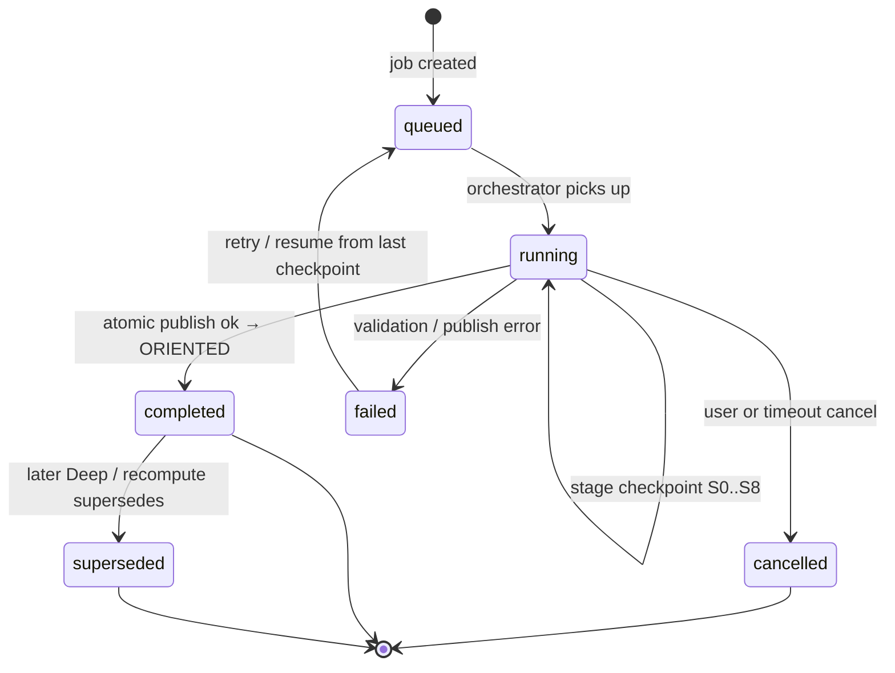

# OSLO Orient Phase (Fast Pass) — Workflow & Architecture Diagrams

**Document Type:** Design artifact — backend workflow diagrams (non-canonical) · **Status:** Non-canonical analysis under Framework 001A · **Date:** 2026-06-10 · **Author:** AI-generated synthesis (Claude)

> **Non-canonical.** This artifact lives in `90_research/` and **informs but does not bind** (DL-033 precedence). It is a synthesized representation of the **Orient phase (= Fast Pass)** for engineering orientation only. On any conflict the canonical sources prevail: the **Analysis Engine Spec** (`30_engineering/analysis_engine/RELEASE_1_ANALYSIS_ENGINE_SPECIFICATION_V1.md`), the **Fast / Deep Pass Stage I/O Specs**, the **Rule/LLM Guidelines**, the **Scope Guardrails**, the **Runtime Object/Behavior/Logical-Data Models**, the **CAF/Confidence/Reliability** scoring models, and the **Wave contracts** (`20_handoff/`). Where this differs from a contract or the decision log, **the ledger/contract wins**. Storage bindings (Supabase Postgres/Neo4j/Supabase pgvector/Supabase Storage/Redis — per DL-054) follow the logical-data-model bindings — confirm against the final infra spec.

The **Orient phase = the Fast Pass**, executed as **one durable `AnalysisRun` job** (`queued → running → completed`), driving the project `created → orienting → oriented`, target **< 60s** (Time-to-First-MRI).

---

## Durable-execution contract (the "side-effect" model)

- The `AnalysisRun` **is** the durable workflow instance; `run_status` is persisted.
- The orchestrator **checkpoints after every stage** → on crash it **resumes from the last checkpoint**.
- **Side effects** the engine records (so replay is deterministic, never re-executed): **LLM calls** (S2–S6), **store writes**, and **emitted events / notifications** → no double LLM spend, no duplicate notifications.
- Events are **idempotent** (deduped by `correlation_id`) and **suppressed on replay**.
- **S8 publish is atomic all-or-none**; failure ⇒ rollback + `run=failed` + project reverts; retriable.
- Maps to the determinism/replay contract: rule steps = exact; LLM steps = band-semantic ±7.

---

## Per-stage matrix (input · output · processing · store)

| Stage | Processing | Input | Output | Store |
|---|---|---|---|---|
| **S0 Intake & Acquisition** | RULE | project, evidence, intent | Evidence rows, `AnalysisRun(queued)` | PG (rows, run) · Supabase Storage (raw body) · Redis (queue) |
| **S1 Normalization** | RULE | raw `content_ref` | span-tagged units | Supabase Storage (units) · Redis (working set) |
| **S2 Global Skeleton** | HYBRID | normalized units (whole corpus) | global map: intent, entity index, rel-skeleton | PG (ctx index) · Neo4j (entity/rel) · Redis (shared ctx) |
| **S3 Claim Extraction** | HYBRID | units + global map | ~50–100 claims (`ContextItem`, horizon=fast) | PG (claims) · Supabase pgvector (embeddings, if enabled) |
| **S4 CAF Evaluation** | HYBRID | claims + map + evidence | `CAFState` (3 dims + per-dim reliability) | PG (`CAFState`) |
| **S5 Finding Generation** | HYBRID | CAF + claims + basis | Findings `status=detected` (7 types, ≥1 evidence link) | PG (index) · Postgres jsonb (CHR snapshot) |
| **S6 Recommendation Gen** | HYBRID | Findings + basis | Recommendations `status=generated` (3 types) | PG (index) · Postgres jsonb (CHR snapshot) |
| **S7 Confidence & State** | RULE | `CAFState` + reliability inputs | `ConfidenceState` (band + qualifier + basis) | PG (`ConfidenceState`) · Redis (live projection) |
| **S8 MRI & Publication** | RULE | CAF, Confidence, Findings, Recs | `MRISnapshot`, `run=completed` | PG (commit + event ledger) · Postgres jsonb (MRI payload) · Redis (cache) |

**Processing legend:** **RULE** = deterministic (no LLM) · **LLM** = semantic judgment · **HYBRID** = rule pre-filter + LLM + rule assembly.

---

## A · Master durable workflow — success path + inline fallbacks

```mermaid
flowchart TD
classDef rule fill:#e0e7ff,stroke:#4338ca,color:#1e1b4b;
classDef llm fill:#f5e8fd,stroke:#7b1fa2,color:#4a148c;
classDef hybrid fill:#ffedd5,stroke:#c2410c,color:#7c2d12;
classDef store fill:#dcfce7,stroke:#15803d,color:#14532d;
classDef ckpt fill:#fef9c3,stroke:#ca8a04,color:#713f12;
classDef bad fill:#fee2e2,stroke:#b91c1c,color:#7f1d1d;
TRIG(["Trigger: first analyzable input<br/>(no completed fast run yet)"])
J0["⛓ Durable job created — AnalysisRun queued→running<br/>emit fast_analysis_requested / _started"]:::ckpt
S0["S0 · INTAKE & ACQUISITION — RULE<br/>in: project, evidence, intent<br/>do: validate envelope ~20k/33k, provenance, enqueue<br/>out: Evidence rows, AnalysisRun<br/>store: PG · Supabase Storage raw · Redis queue"]:::rule
OVR{"envelope oversize?"}
OVRF["FALLBACK · accept but route DEEP-only<br/>(skip Fast, queue for Deep)"]:::bad
S1["S1 · NORMALIZATION — RULE<br/>in: raw content_ref<br/>do: parse, de-boilerplate, segment, span-tag<br/>out: span-tagged units<br/>store: Supabase Storage units · Redis working set"]:::rule
CK1["⛓ checkpoint"]:::ckpt
S2["S2 · GLOBAL SKELETON — HYBRID<br/>RULE: NER entity index, cross-ref link<br/>LLM: intent restatement, relationship skeleton<br/>out: global map (fast-horizon ContextItems)<br/>store: PG ctx · Neo4j rel · Redis shared ctx"]:::hybrid
SKOK{"skeleton built?"}
SKF["FALLBACK · isolation-only mode<br/>Coverage↓ → reliability↓<br/>run CONTINUES (not failed)"]:::bad
S3["S3 · CLAIM EXTRACTION — HYBRID<br/>RULE: assertion pre-filter, dedup_key/hash<br/>LLM: identify claims (paraphrased/implicit)<br/>out: ~50–100 claims<br/>store: PG claims · pgvector embeddings"]:::hybrid
S4["S4 · CAF EVALUATION — HYBRID<br/>RULE: Clarity detectors, constraint NER, coverage set-diff<br/>LLM: Alignment/Feasibility (preliminary)<br/>out: CAFState (3 dims + reliability)<br/>store: PG CAFState"]:::hybrid
S5["S5 · FINDING GENERATION — HYBRID<br/>detect (rule/LLM) → emit (RULE) Findings<br/>out: Findings detected (7 types, ≥1 evidence link)<br/>store: PG index · PG jsonb CHR snapshot"]:::hybrid
S6["S6 · RECOMMENDATION GEN — HYBRID<br/>RULE: finding-type→rec-type map<br/>LLM: rationale phrasing<br/>out: Recommendations generated (3 types)<br/>store: PG index · PG jsonb CHR snapshot"]:::hybrid
S7["S7 · CONFIDENCE & STATE — RULE<br/>do: consolidate power-mean p=-0.5 ε=5, qualify<br/>out: ConfidenceState (band + reliability + basis)<br/>store: PG ConfidenceState · Redis projection"]:::rule
CK2["⛓ checkpoint (pre-publish)"]:::ckpt
S8["S8 · MRI & PUBLICATION — RULE<br/>do: build MRI, ATOMIC commit all-or-none<br/>store: PG commit+ledger · PG jsonb MRI · Redis cache"]:::rule
PUBOK{"atomic commit ok?"}
PUBF["FALLBACK · rollback (nothing persisted)<br/>run=failed → Project reverts to created<br/>emit analysis_failed → retry/resume"]:::bad
DONE["✅ SUCCESS — Project orienting→ORIENTED<br/>ordered fan-out (one correlation_id):<br/>fast_analysis_completed → confidence_created →<br/>finding_created×N → recommendation_created×M → notification_created<br/>banner: not final — Deep to follow"]:::store
TRIG --> J0
J0 --> S0
S0 --> OVR
OVR -->|yes| OVRF
OVR -->|no| S1
S1 --> CK1
CK1 --> S2
S2 --> SKOK
SKOK -->|"fail / timeout"| SKF
SKF --> S3
SKOK -->|yes| S3
S3 --> S4
S4 --> S5
S5 --> S6
S6 --> S7
S7 --> CK2
CK2 --> S8
S8 --> PUBOK
PUBOK -->|no| PUBF
PUBOK -->|yes| DONE
```



---

## B · Durable orchestration sequence — side-effects + crash/resume

```mermaid
sequenceDiagram
autonumber
actor U as Trigger
participant O as Durable Orchestrator
participant RW as Rule Worker
participant LW as LLM Worker
participant DB as Datastores
participant EB as Event Bus
U->>O: start Fast Pass (project, evidence)
O->>DB: create AnalysisRun (queued→running)
O->>EB: fast_analysis_requested / _started
Note over O: each stage checkpointed; LLM calls,<br/>writes, events recorded for replay
O->>RW: S0 intake/validate, S1 normalize
RW->>DB: persist Evidence + span-tagged units
RW-->>O: stage output (checkpoint ok)
O->>RW: S2 NER index + cross-ref
O->>LW: S2 intent + relationship skeleton
alt skeleton OK
  LW-->>O: global map (recorded)
  O->>DB: persist ContextItems + Neo4j skeleton
else fails or times out
  LW-->>O: error
  Note over O: FALLBACK isolation-only<br/>(coverage↓, reliability↓); run continues
end
O-->>O: checkpoint ok
rect rgb(254,226,226)
  Note over O,LW: 💥 crash mid-run
  O-->>O: RESUME from last checkpoint;<br/>replay recorded side effects<br/>(no double LLM call, events deduped)
end
O->>LW: S3 claims, S4 Alignment/Feasibility
O->>RW: S4 Clarity/coverage, S5 findings, S6 rec-map, S7 confidence
RW->>DB: persist claims, CAFState, Findings, Recs, ConfidenceState + CHR
O-->>O: checkpoint ok (pre-publish)
O->>RW: S8 build MRI + ATOMIC commit
alt commit OK
  RW->>DB: commit MRISnapshot + run=completed
  O->>EB: ordered fan-out (confidence→findings→recs→notification)
  O->>U: Project ORIENTED — 60-second orientation ready
else commit fails
  RW->>DB: rollback (nothing persisted)
  O->>EB: analysis_failed
  O->>U: revert to created; retry/resume
end
```

---

## C · Durable job (`AnalysisRun`) state machine



---

## D · Fallback sub-flows

```mermaid
flowchart TD
classDef bad fill:#fee2e2,stroke:#b91c1c,color:#7f1d1d;
classDef ok fill:#dcfce7,stroke:#15803d,color:#14532d;
subgraph FB1["Fallback 1 · Oversize input (S0)"]
  A1{"tokens > envelope?"}
  A2["accept, skip Fast,<br/>route to Deep-only queue"]:::bad
  A3["proceed Fast"]:::ok
  A1 -->|yes| A2
  A1 -->|no| A3
end
subgraph FB2["Fallback 2 · Skeleton failure (S2)"]
  B1{"global map built?"}
  B2["isolation-only: per-unit eval,<br/>coverage↓ → reliability↓"]:::bad
  B3["full global context"]:::ok
  B4["run CONTINUES — not failed"]:::ok
  B1 -->|"no / timeout"| B2
  B1 -->|yes| B3
  B2 --> B4
end
subgraph FB3["Fallback 3 · LLM invalid or timeout (S2–S6)"]
  C1{"LLM output valid vs schema?"}
  C6["use result (record side effect)"]:::ok
  C2["retry — bounded, TBD"]:::bad
  C3{"still failing?"}
  C4["degrade: skip semantic enrichment,<br/>mark reliability↓"]:::bad
  C5["fail stage → job failed"]:::bad
  C1 -->|yes| C6
  C1 -->|no| C2
  C2 --> C3
  C3 -->|"non-critical"| C4
  C3 -->|"critical"| C5
end
subgraph FB4["Fallback 4 · Atomic publish failure (S8)"]
  D1{"commit all-or-none ok?"}
  D5["ORIENTED + ordered events"]:::ok
  D2["rollback — nothing persisted"]:::bad
  D3["run=failed, Project→created,<br/>emit analysis_failed"]:::bad
  D4["retry / resume from pre-publish checkpoint"]:::ok
  D1 -->|yes| D5
  D1 -->|no| D2
  D2 --> D3
  D3 --> D4
end
subgraph FB5["Fallback 5 · Process crash (any stage)"]
  E1["💥 worker / orchestrator dies"]
  E2["durable engine detects timeout"]
  E3["RESUME from last checkpoint;<br/>replay recorded side effects<br/>(no duplicate LLM calls; events deduped)"]:::ok
  E4["continue to completion"]:::ok
  E1 --> E2
  E2 --> E3
  E3 --> E4
end
```



---

## Guardrails enforced throughout (Scope Guardrails + Rule/LLM Guidelines)

- LLM may **never** invent formulas / weights / thresholds, nor emit **bare** confidence.
- **Findings are descriptive; Recommendations are advisory** (anchored to a Finding; never auto-applied).
- Every output carries a **resolvable source-span / basis** (explainability).
- **Fast output is never final** — always labeled "not final — Deep to follow."
- **Only recompute changes assessment**; prior outputs are **superseded, not deleted**.

## Source references (canonical)

- `30_engineering/analysis_engine/RELEASE_1_ANALYSIS_ENGINE_SPECIFICATION_V1.md`
- `30_engineering/analysis_engine/FAST_PASS_STAGE_IO_SPEC.md` · `DEEP_PASS_STAGE_IO_SPEC.md`
- `30_engineering/analysis_engine/RULE_LLM_GUIDELINES.md` · `SCOPE_GUARDRAILS.md` · `CONSOLIDATED_ARCHITECTURE_GUIDELINES.md`
- `30_engineering/scoring/CAF_SCORING_MODEL_V2.md` · `CONFIDENCE_MODEL_V2.md` · `RELIABILITY_MODEL_V2.md`
- `30_engineering/runtime_models/RELEASE_1_RUNTIME_OBJECT_MODEL_V1.md` · `RELEASE_1_RUNTIME_BEHAVIOR_MODEL_V1.md`
- `20_handoff/` Wave A/B contracts + `traceability/RELEASE_1_BUILD_TEST_OBSERVE_TRACEABILITY_MATRIX.md`
