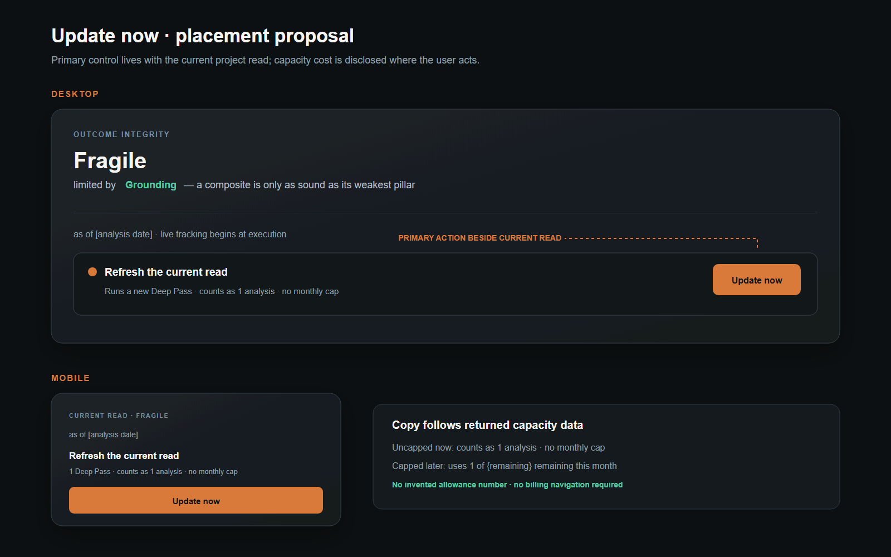

# Update now — project read placement mockup

**Status:** Placement approved by the owner on 2026-09-11. The exhausted state below incorporates the owner’s required accessibility and reset-date refinements.

**Contract basis:** `IC-WE-DISCLOSE` (project read presentation) · `IC-WA-00R` (event-driven recompute).

## Proposed placement

Place the primary **Update now** control in the Outcome Integrity read header, directly beside the current read's **as of** line. The action remains part of the project read loop rather than account or billing navigation.

## Capacity disclosure

The current Free and Basic policies expose `monthly_analysis_limit: null`. The product already records `monthly_analyses_used`, and the existing usage surface states that an update is one analysis and no cap is enforced.

- Current uncapped copy: **Runs a new Deep Pass · counts as 1 analysis · no monthly cap**
- Future capped copy, only when the API returns a numeric limit: **Runs a new Deep Pass · uses 1 of {remaining} remaining this month**

No allowance number is invented in this mockup.

## Interaction states retained from PR #337

- Idle: **Update now**
- Request in progress: **Starting…**, disabled against duplicate submission
- Failed request: honest unchanged-data message plus **Try again**
- Successful request: continue to the resulting analysis run
- No raw transport error is shown

## Exhausted capacity

- The action remains keyboard-focusable with `aria-disabled="true"`; activation is refused without sending a request.
- `aria-describedby` associates the action with: **0 analyses remaining this month. Your current read remains available. Resets {date}.**
- `{date}` comes from returned capacity data. The surface does not invent an allowance or reset date.

## Responsive behavior

- Desktop: the disclosure and action sit on the same row as the read timestamp.
- Mobile: the disclosure remains immediately below the timestamp and the action becomes full width.

No application behavior or Production data is changed by this mockup commit.
