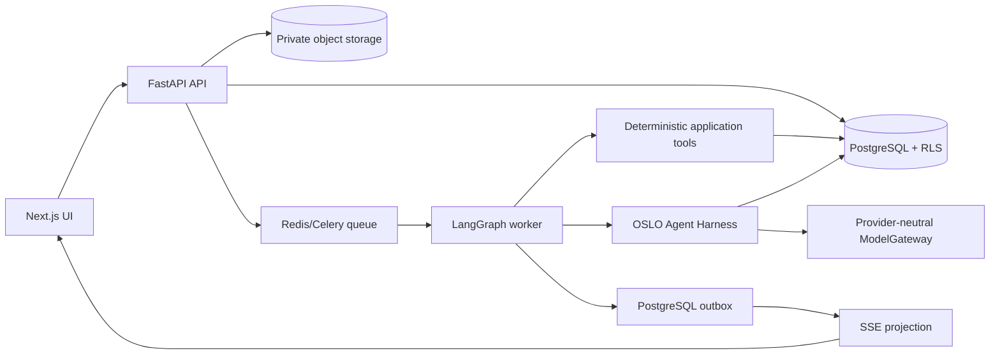

# Slice 2 implementation plan

- Status: approved implementation baseline after Slice 2 grill session
- Branch: `feature/slice-2`
- Date: 2026-07-23
- Scope: Intake, Initial Analysis, orientation, Overview, Extended Analysis, Attention, Issues, clarification, OSLO Chat and failure recovery
- Delivery method: tracer bullets with TDD, review and QA gates

## 1. Outcome

Deliver a production-shaped Slice 2 flow while keeping Slice 1 regression-clean:

```text
Authenticated Intake
  -> submit description, template, sample or documents
  -> deterministic and then governed analysis
  -> provisional Overview
  -> one-time orientation
  -> automatic Extended Analysis
  -> current result or preserved last-good result
  -> clarification answer
  -> reanalysis and updated issue state
```

The product must match the golden prototype's information hierarchy and user-visible states. The implementation must replace client timers, localStorage business truth and hard-coded findings with API contracts, tenant-scoped persistence, background execution, validated outputs and observable events.

## 2. Agreed decisions

### In scope

- Four intake methods: description, documents, templates and sample project.
- Initial Analysis producing a provisional immutable snapshot.
- One-time orientation with replay from the account menu.
- Overview sections in this exact order: Confidence, Start here, Progress, More.
- Attention Map, Dimensions view and light Issue detail.
- Persistent/collapsible OSLO Chat with analysis notices and grounded context handoff.
- Automatic Extended Analysis, successful supersession, last-good failure state and retry.
- Clarification answer as new evidence followed by reanalysis.
- Seven artifacts: Intent, Context, Scope, Requirements, Work breakdown, Schedule and Resources.
- Three governed LLM calls: Perceive, Construct and Evaluate.
- TXT, MD, PDF and DOCX first; PPTX, XLSX and CSV before Slice 2 sign-off.
- Desktop, tablet, mobile, keyboard and reduced-motion support.

### Out of scope

- OpenClaw or Hermes as the production runtime.
- Guided Q&A intake.
- OCR for scanned/image-only documents.
- Anonymous Alpha access.
- Manual issue resolution.
- Full Issue management, artifact editing or History UI from later slices.
- Arbitrary autonomous shell, filesystem, browser or messaging access for the LLM.
- Persisting hidden chain-of-thought.

### Approved architecture

- Next.js/React/TypeScript web application in `apps/web`.
- FastAPI/Pydantic application and analysis capabilities in `services/api`.
- A separate Celery worker process using the same Python capability package.
- LangGraph for typed orchestration, transitions, retries and checkpoints.
- A custom OSLO Agent Harness around the three LLM nodes.
- Provider-neutral `ModelGateway`, with OpenAI as the first configured adapter.
- Supabase Local for PostgreSQL, Auth and private Storage.
- PostgreSQL RLS for workspace isolation and pgvector for evidence retrieval.
- Redis for Celery coordination and disposable runtime coordination only.
- Supabase SQL migrations as the only database migration history.
- SSE for safe one-way analysis progress updates.

## 3. Architecture boundaries



### LangGraph owns

- Node order and conditional transitions.
- Typed graph state.
- Initial versus Extended run mode.
- Bounded retry routing by error class.
- Checkpoint and resume behavior.
- Clarification interrupt/resume behavior.
- Failure transition to last-good.
- Idempotent execution boundaries.

### OSLO Agent Harness owns

- The Perceive, Construct and Evaluate skill packages.
- Approved system prompts and prompt versions.
- Model selection through `ModelGateway`.
- Tool allow-lists and time/token budgets.
- Pydantic input/output schemas.
- Prompt-injection boundaries and source-data delimiting.
- Structured-output validation and repair retry.
- Model usage, latency and version metadata.

### Application/data services own

- Authentication and workspace authorization.
- Intake submission and upload authorization.
- File validation, parsing and immutable fragment creation.
- Tenant-filtered retrieval and evidence resolution.
- Snapshot publication and current-pointer movement.
- Outbox events and safe SSE projection.
- Database RLS and object-storage policies.

## 4. Logical workflow

| Step | Owner | LLM | Responsibility | Durable output |
|---|---|---:|---|---|
| 1. Submit intake | App service | 0 | Validate request and create idempotent intake/run records | Intake submission and queued run |
| 2. Validate scope | LangGraph control | 0 | Re-check user, workspace, project and allowed source versions | Authorized typed state |
| 3. Ingest and parse | App tool node | 0 | Validate documents and create immutable located fragments | Documents and fragments |
| 4. Perceive | Agent Harness | 1/3 | Extract facts, claims, requirements, assumptions and gaps | Perception contract |
| 5. Retrieve evidence | App tool node | 0 | Scope first, retrieve with pgvector, then resolve and validate | Evidence items and links |
| 6. Construct artifacts | Agent Harness | 2/3 | Construct exactly seven evidence-qualified artifacts | Candidate artifact versions |
| 7. Checkpoint | LangGraph control | 0 | Persist restartable typed state and attempt metadata | Durable checkpoint |
| 8. Evaluate and advise | Agent Harness | 3/3 | Propose evidence-grounded issues, fixes, clarifications and assessment factors | Candidate assessment |
| 9. Validate result | App service | 0 | Deterministically calculate/enforce CAF, reliability, schema, evidence and policy gates | Validated publish command |
| 10. Publish atomically | App service | 0 | Insert immutable snapshot, observations and outbox event; move pointer | Provisional/current snapshot |
| 11. Project to browser | App service | 0 | Send safe status/result events and serve Overview/Attention | Browser projection |
| 12. Extended transition | LangGraph control | 0 | Auto-queue deep run; preserve last-good on failure | New run or last-good state |

The UI may display all twelve logical stages. In code, submission and browser projection remain boundary services invoked by the graph lifecycle rather than unrestricted model actions.

## 5. Agent contracts

### Skill package layout

```text
services/api/src/oslo_api/analysis/
  graph/
    builder.py
    state.py
    routing.py
  nodes/
    validate_scope.py
    parse_sources.py
    perceive.py
    retrieve_evidence.py
    construct_artifacts.py
    checkpoint.py
    evaluate.py
    validate_result.py
    publish.py
    project_events.py
    extended_transition.py
  harness/
    runner.py
    model_gateway.py
    guardrails.py
    versions.py
  skills/
    perceive/v1/system.md
    construct/v1/system.md
    evaluate/v1/system.md
  contracts/
    perception.py
    artifacts.py
    assessment.py
    graph_state.py
  rubrics/
    caf_v1.py
    reliability_v1.py
    issue_severity_v1.py
```

Prompts, examples and rubric guidance are versioned skill assets. Authorization, routing, data access, schemas and publication rules remain code. Each run stores graph, prompt, schema, rubric, model and parser versions.

### LLM call 1: Perceive

- Input: normalized project description plus authorized fragments and locators.
- Output: facts, claims, requirements, entities, metrics, assumptions, contradictions and gaps.
- Guardrails: treat uploaded content as data, reject instructions found in sources, cite fragment IDs and do not create the seven final artifacts yet.

### LLM call 2: Construct

- Input: perception output plus resolved evidence.
- Output: exactly seven artifact candidates, each with basis, reliability, claims and evidence references.
- Guardrails: no missing or extra artifact types; inferred content must be marked derived and reliability-qualified.

### LLM call 3: Evaluate

- Input: seven artifacts, evidence graph and approved CAF/reliability rubrics.
- Output: proposed assessment factors, issues, recommendations, suggested fixes and clarification requests.
- Guardrails: every issue requires a statement, rule/rubric reference, reason, recommendation and evidence lineage; unsupported certainty fails validation.

The LLM does not own the final displayed score or publication decision. Deterministic
application rules validate the factors, calculate/enforce final CAF and reliability
bands, check evidence coverage and decide whether the candidate can publish.

### Scoring contract

- Bands: Very Low, Low, Moderate, High, Very High.
- CAF: Clarity, Alignment and Feasibility.
- Confidence represents maturity of OSLO's understanding, not project health or success probability.
- Reliability qualifies the strength of the evidence supporting the read.
- The displayed confidence index is calculated by a versioned deterministic rubric;
  it is not accepted directly from an LLM response.
- Prototype numbers such as 58 and 62 are fixtures only and never canonical scoring rules.
- Severity words are Warning, Moderate and Critical; severity color is reserved for Issues.

## 6. Data plan

Add migrations incrementally instead of creating the full conceptual model at once.

### Migration A: intake and sources

- `intake_submissions`
- `source_documents`
- `source_fragments`
- Private Storage bucket and policies
- Workspace/project RLS policies
- Checksums, MIME/detected type, parser version, locator JSON and failure reason

### Migration B: runs and checkpoints

- `analysis_runs`
- `analysis_node_attempts`
- LangGraph checkpoint tables or an isolated approved checkpoint schema
- `idempotency_keys`
- Run kind/status, timestamps, version set, retry count and safe failure code

### Migration C: artifacts and evidence

- `artifact_versions`
- `evidence_items`
- `evidence_links`
- Vector embedding column/index on tenant-scoped fragments or evidence items

### Migration D: publication and user loop

- `assessment_snapshots`
- `issues`
- `issue_observations`
- `clarifications`
- `clarification_answers`
- `outbox_events`
- Completed-only project current-snapshot pointer

### Persistence rules

- Every workspace-owned table has default-deny RLS.
- IDs are server-generated; browser-supplied workspace IDs are never trusted alone.
- Original files use opaque object keys and private buckets.
- Source fragments are immutable per source version.
- Snapshots and observations are append-only.
- Only a completed publication transaction moves the current pointer.
- Extended failure never changes the visible snapshot.
- No raw invitation tokens, API keys, credentials or hidden reasoning are persisted.

### Durable execution and refresh contract

The browser never owns analysis progress. Closing, refreshing or losing the browser
connection has no effect on the worker run.

1. Intake submission and an `analysis_runs(status = queued)` row are committed with
   an outbox event in one PostgreSQL transaction.
2. A dispatcher delivers the outbox event to Celery. Redelivery is expected and
   harmless because the run and every node side effect are idempotent.
3. The worker claims the run with a lease, changes it to `running` and writes an
   `analysis_node_attempts` row before each node.
4. LangGraph writes a durable checkpoint after every expensive or externally
   observable stage. Large encrypted graph state lives in object storage; PostgreSQL
   keeps its hash, version, locator and status.
5. On refresh, the web application reads the run from FastAPI, renders its last
   completed safe phase and reconnects to SSE using the last event ID.
6. A worker crash or deployment restart lets another worker reclaim the expired
   lease and resume from the last valid checkpoint.
7. A node retry stays in the same run. A user-requested full restart creates a linked
   run and never overwrites the original lineage.
8. Snapshot insertion, run completion, project current-pointer movement and the
   publication outbox event occur in one transaction.
9. Only `completed` runs become visible truth. `failed`, `deferred`, cancelled or
   partially written runs preserve the existing provisional/current last-good view.

### Concurrency contract

- One active Initial run is allowed per project and intake version.
- One active Extended run is allowed per completed Initial snapshot.
- Database uniqueness plus an idempotency key prevents double-click, network retry
  and duplicate queue delivery from creating duplicate work.
- A newer source version does not mutate an active run. It queues a new run linked
  to the new immutable source set.
- Publication uses optimistic version checking on the project current pointer.
  A stale run remains in History but cannot replace a newer compatible result.
- Cancellation is cooperative between nodes. A model call already in flight may
  finish, but its result cannot publish after cancellation.

## 7. API and event plan

The detailed transport, replay, authentication, scaling and QA design is defined in
[Slice 2 SSE streaming deep-dive plan](slice-02-sse-streaming-plan.md).

### HTTP contracts

```text
POST /v1/projects/{project_id}/intake-submissions
POST /v1/intake-submissions/{id}/uploads/presign
POST /v1/intake-submissions/{id}/submit
POST /v1/projects/{project_id}/analysis-runs
GET  /v1/analysis-runs/{run_id}
GET  /v1/analysis-runs/{run_id}/events
POST /v1/analysis-runs/{run_id}/retry
GET  /v1/projects/{project_id}/overview
GET  /v1/projects/{project_id}/attention
GET  /v1/projects/{project_id}/issues/{issue_id}
POST /v1/clarifications/{id}/answers
```

All mutation endpoints require an idempotency key. FastAPI OpenAPI remains the source of truth, and generated/shared TypeScript contracts belong in `packages/contracts`.

### Safe SSE events

- `analysis.queued`
- `analysis.started`
- `analysis.phase_started`
- `analysis.phase_completed`
- `analysis.interrupted`
- `analysis.completed`
- `analysis.failed`
- `assessment.published`
- `extended.queued`

Events expose run IDs, safe phase labels, timestamps, state and user-safe error codes. They never expose prompts, raw source text, secrets or hidden reasoning.

## 8. UI implementation plan

Refactor the current `IntakeExperience` state machine so the server is authoritative.
The complete visual, interaction, responsive and screenshot contract is defined in
[Slice 2 golden-prototype UI parity plan](slice-02-prototype-ui-parity-plan.md).

The golden HTML prototype is the design source of truth. Production code replaces
its timers, localStorage and fixtures, but does not redesign its information
hierarchy, wording, layout or interaction model.

### Intake

- Preserve the current four start methods and prototype styling.
- Validate file count, size and detected/allowed type.
- Display upload and per-file parse states.
- Keep `See where I stand` disabled until minimum valid input exists.
- Sample and templates fill the composer but never auto-start.

### Analysis progress

- Replace timers with SSE-driven phases.
- Show truthful phase names, elapsed time and recoverable errors.
- Honor reduced motion without hiding progress text.

### Orientation

- Read/write server-backed onboarding state.
- Show automatically only for the first completed project.
- Support replay from the account menu.

### Overview

- Exact order: Confidence, Start here, Progress, More.
- Show Provisional, Current or Last-good state.
- Show Reliability inline with Confidence.
- Match the prototype: More contains the optional Project summary only.
- Represent the seven artifacts as structured data and rows in Attention.
- Put completion/failure notices in OSLO Chat, not Overview banners.

### Attention and Issues

- Seven artifact rows by Clarity/Alignment/Feasibility columns.
- Only issue cells use severity color.
- Cell selection opens the light Issue panel.
- Issue panel includes lifecycle, Why, Evidence, clarification, suggested fixes and resolved confirmation.

### OSLO Chat

- Receive Initial, Extended, failure and retry notices.
- Accept Confidence or Issue context.
- Answer only from the current structured snapshot.
- Route actions to existing application commands.
- Use the same clarification command as the Issue panel.
- Never mutate artifacts or close issues directly.

## 9. Delivery phases and TDD gates

### Phase 0: ADRs, contracts and fixtures

Work:

- Record ADRs for LangGraph/harness boundary, background execution, model gateway, storage/checkpointing and retention assumptions.
- Define IDs, tenant context, error envelope, idempotency and safe event schemas.
- Create deterministic DevNorth fixtures and expected provisional/current outputs.
- Add Slice 2 dependencies with pinned lockfiles.

Tests first:

- Contract serialization tests.
- Seven-artifact enum and completeness tests.
- Graph-state round-trip tests.
- Fixture schema validation tests.

Exit gate: contracts and fixtures pass without any real LLM call.

### Phase 1: deterministic vertical tracer

Work:

- Description/Sample intake creates a real submission and run.
- Worker executes deterministic node adapters.
- SSE drives the analysis screen.
- One completed transaction publishes a provisional snapshot.
- Overview reads the snapshot from the API.

Tests first:

- Empty intake rejected.
- Duplicate submit creates one run.
- Queued -> running -> completed event sequence.
- Partial/failed run cannot move the current pointer.
- E2E: Sample -> click start -> provisional Overview.

Exit gate: UI, API, database, worker, SSE and snapshot publication work end to end without AI complexity.

### Phase 2: prototype UI parity

Work:

- Complete Overview sections and state chips.
- Add one-time orientation and replay.
- Add Attention, light Issue detail and initial OSLO Chat rail.
- Add responsive and reduced-motion behavior.

Tests first:

- Orientation first-run/replay tests.
- Exact Overview section-order test.
- Attention cell opens correct issue.
- Keyboard and reduced-motion component tests.
- Desktop/mobile Playwright screenshot baselines.

Exit gate: deterministic data renders the approved golden states.

### Phase 3: uploads and parsing

Work:

- Create private bucket and signed-upload adapter.
- Implement safety validation and immutable source versions.
- Add TXT/MD, PDF and DOCX parser adapters.
- Add PPTX, XLSX and CSV adapters before Slice 2 sign-off.
- Produce stable checksums and page/paragraph/slide/sheet/table locators.

Tests first:

- Extension/MIME mismatch rejection.
- Oversized and too-many-files rejection.
- Stable locator/checksum fixtures.
- One failed file does not corrupt valid sources.
- Image-only PDF returns unsupported/insufficient-content.
- Cross-workspace upload/read denial.

Exit gate: supported files produce authorized immutable fragments or honest per-file errors.

### Phase 4: governed LangGraph

Work:

- Implement typed graph state and all deterministic nodes.
- Add PostgreSQL checkpointer and bounded retry routing.
- Record one attempt per node execution.
- Make every side effect idempotent.
- Keep deterministic Perceive/Construct/Evaluate adapters initially.

Tests first:

- Valid transition sequence.
- Resume from checkpoint without duplicate side effects.
- Retryable versus terminal failure routing.
- Tenant scope revalidated inside the worker.
- Duplicate worker delivery publishes once.

Exit gate: a restartable deterministic graph publishes the same fixture snapshot consistently.

### Phase 5: retrieval and real Agent Harness

Work:

- Implement tenant-filtered pgvector candidate retrieval and evidence resolution.
- Add versioned Perceive, Construct and Evaluate skill packages.
- Implement OpenAI adapter behind `ModelGateway`.
- Add budgets, timeouts, structured-output validation and bounded repair retry.
- Record model/prompt/schema/rubric versions and usage metadata.

Tests first:

- Retrieval scopes before similarity search.
- Citation locators resolve to authorized fragments.
- Prompt-injection text is treated as source data.
- Invalid JSON and missing artifact trigger bounded repair.
- Unsupported load-bearing claims fail publication.
- Golden eval fixtures cover thin, contradictory and sufficient evidence.

Exit gate: three real governed LLM calls produce a validated, traceable provisional snapshot.

### Phase 6: Extended Analysis and recovery

Work:

- Auto-queue Extended after provisional publication.
- Reuse the same graph contract with deeper budgets.
- Publish a new current snapshot on success.
- Preserve last-good on failure and expose Retry through Chat.

Tests first:

- Extended auto-queues exactly once.
- Success supersedes provisional atomically.
- Failure leaves current pointer unchanged.
- Retry resumes/restarts safely without duplicate snapshots.
- UI shows Provisional -> Current and failure -> Last-good.

Exit gate: success, failure, last-good and retry paths pass API and E2E tests.

### Phase 7: clarification and grounded Chat

Work:

- Implement Issue and Chat entry points through one context contract.
- Save clarification answers as governed evidence.
- Start a new analysis run after an answer.
- Update issue observations only through completed reanalysis.

Tests first:

- Empty/unauthorized/duplicate clarification rejected or idempotent.
- Panel and Chat use the same command.
- Answer does not manually resolve an issue.
- Completed reanalysis can change the issue observation and artifact basis.
- Chat cannot invent unavailable project state or call unapproved mutations.

Exit gate: clarification closes the evidence-to-reanalysis loop with complete lineage.

### Phase 8: hardening and release candidate

Work:

- Add rate limits, CSRF checks, malware-scanner adapter boundary and safe telemetry.
- Complete all parser formats or record an explicit approved deferment.
- Run performance, concurrency and worker-recovery tests.
- Complete feature tour, accessibility and visual parity.
- Review retention configuration and production provider decisions.

Tests first:

- RLS negative matrix for every new table.
- No secrets/raw documents in logs or SSE.
- Queue redelivery and worker-crash recovery.
- Initial Analysis target under 60 seconds on the approved fixture/environment.
- Extended target under five minutes without blocking the user.
- Full Slice 1 and Slice 2 Playwright suites.

Exit gate: all automated gates, AI review, human review and manual QA are complete.

## 10. Test matrix

| Level | Primary coverage |
|---|---|
| Unit | Scoring rules, transitions, idempotency, parsers, validators, redaction |
| Contract | FastAPI/Pydantic/OpenAPI/TypeScript/SSE payload agreement |
| Database | Migrations, constraints, RLS, atomic publication, current pointer |
| Integration | Upload -> parse -> retrieve -> graph -> snapshot -> SSE |
| Model evaluation | Grounding, citations, contradictions, thin evidence, prompt/schema regressions |
| Web component | Intake gate, states, orientation, views, Issue panel, Chat |
| E2E | Twenty approved Slice 2 scenarios plus Slice 1 regression suite |
| Visual | Intake, analyzing, orientation, provisional/current/last-good, Attention, Issue, Chat, mobile |
| Accessibility | Keyboard, focus, dialogs, live regions, labels, reduced motion and axe smoke |
| Resilience | Duplicate delivery, retries, checkpoint resume, Redis/worker failure and last-good preservation |

No phase is complete until its tests are green and the prior phases remain green.

## 11. Security and privacy gates

- Enforce authorization in FastAPI and RLS in PostgreSQL.
- Force/test RLS for application roles and cross-tenant negative cases.
- Authorize the project before issuing a signed upload URL.
- Detect type from content, not extension alone.
- Quarantine before parsing once the malware adapter is enabled.
- Defend against macros, formula injection, zip bombs and oversized extracted content.
- Never execute uploaded content.
- Delimit source content as untrusted data in every model call.
- Keep signed URLs short-lived and resource-scoped.
- Store API keys only in server/worker environment configuration.
- Redact raw source content, tokens and sensitive prompt inputs from logs and traces.
- Make retention configurable; Alpha baseline is hard deletion of project content within 30 days after project deletion, subject to client/legal approval before production.

## 12. Observability and operational gates

Every run carries `workspace_id`, `project_id`, `submission_id`, `run_id` and correlation ID.

Record:

- Queue wait, node latency, total run latency and publication latency.
- Safe node status and attempt count.
- Parser/model/prompt/graph/rubric/schema versions.
- Token and cost metadata without raw content.
- Retry/failure class and safe error code.
- Snapshot publication and outbox-delivery status.

Alert on:

- Repeated graph failures.
- Stuck queued/running runs.
- Outbox backlog.
- Cross-tenant authorization failures.
- Initial Analysis SLO breach.
- Unexpected model/schema validation regression.

### Service-level objectives

The diagram timings are hypotheses until measured through the API with the approved
model, documents and deployment region. Release decisions use p95, not a single
interactive ChatGPT timing.

| Measure | Alpha target | Hard guard |
|---|---:|---:|
| Intake API acknowledgement | p95 < 1 second | 3 seconds |
| SSE progress visibility after queue claim | p95 < 2 seconds | 5 seconds |
| Fast Pass, small/normal approved fixture | p95 < 60 seconds | 90 seconds |
| Extended Analysis | p95 < 5 minutes | 5-minute run timeout |
| Overview read from current snapshot | p95 < 500 ms | 2 seconds |
| Successful checkpoint recovery | > 99% in fault tests | No duplicate publish |

Benchmark small, normal and maximum approved fixtures at least 20 times after
warm-up. Record queue time, parse time, retrieval time, each model's time-to-first
token and completion time, input/output tokens, validation time and publication
time. Replace estimates with measured p50/p95/p99 before production sign-off.

### Capacity, scaling and cost controls

- Scale API and worker processes independently.
- Use separate worker queues for parsing, embedding and analysis so large documents
  cannot starve user-visible Fast Pass runs.
- Give Fast Pass a higher queue priority while enforcing fair per-workspace quotas.
- Bound file count, extracted bytes, fragments, retrieval candidates, prompt tokens,
  output tokens, node duration, retries and concurrent runs per workspace.
- Parse independent files and generate embedding batches in parallel; run the three
  dependent LLM skills sequentially because each consumes the validated prior result.
- Cache immutable parsing and embeddings by content checksum and version. Never
  cache authorization decisions or treat Redis as business truth.
- Filter by workspace/project before vector ordering and add indexes only from
  measured query plans. Start with pgvector; separate it only after evidence shows
  PostgreSQL is the bottleneck.
- Use connection pooling, worker prefetch limits, exponential backoff with jitter,
  circuit breakers for degraded providers and admission control when queues exceed
  the approved depth.
- Enforce Fast and Extended token envelopes in code. A context planner ranks and
  truncates evidence deterministically; it never silently exceeds the model budget.
- Track cost per run, tokens per artifact and cache hit rate. Alert on budget
  regression by prompt/model version.

### Failure and recovery matrix

| Scenario | Required behavior | Verification |
|---|---|---|
| Browser refresh, tab close or SSE disconnect | Run continues; GET rehydrates state; SSE resumes from last event | E2E refresh/disconnect |
| Network drops after submit | Same idempotency key returns the original submission/run | API integration |
| User double-clicks start | Exactly one active run is created | Concurrency test |
| Duplicate Celery delivery | Existing node/run result is reused; one snapshot publishes | Worker integration |
| Worker crashes before checkpoint | Lease expires; node restarts safely | Fault injection |
| Worker crashes after checkpoint | Resume from next valid boundary | Fault injection |
| API or worker deploys during run | Version-compatible run resumes; incompatible run defers safely | Rolling-restart test |
| Redis restarts | PostgreSQL remains truth; outbox redispatch restores queued work | Infrastructure test |
| Object storage unavailable | Retry boundedly; fail safely without publishing | Adapter fault test |
| Parser fails for one file | Honest per-file failure; policy decides whether remaining evidence is sufficient | Parser integration |
| Embedding provider fails | Retry/circuit-break; do not cite missing vector results | Provider fault test |
| LLM timeout/rate limit/5xx | One bounded retry with jitter; safe failure after budget | Gateway contract |
| Invalid or incomplete structured output | One repair attempt; validation failure never publishes | Model evaluation |
| Prompt injection in a document | Treat as quoted evidence data; no unauthorized tool/model behavior | Adversarial eval |
| Database commit fails | No pointer movement and no publication event | Transaction test |
| Commit succeeds but event delivery fails | Outbox retries until delivered | Outbox integration |
| Initial Analysis fails with no prior result | Show recoverable failure and Retry; no fabricated Overview | E2E failure |
| Extended Analysis fails | Keep provisional/current last-good and expose Retry in Chat | E2E failure |
| Two runs finish out of order | Compatibility/version check prevents stale publication | Race test |
| Session expires while viewing progress | Run continues; protected data requires re-authentication | Auth E2E |
| Cross-workspace run/event/source ID | Return not-found/forbidden without leakage | RLS/API negative |
| User cancels or deletes project mid-run | Stop future nodes; revoke publication; execute retention workflow | Lifecycle test |
| Provider/model version changes | Active run keeps its recorded version set; new runs use new version | Reproducibility test |

### Operational recovery

- A scheduled reconciler finds stuck leases, queued runs without dispatched jobs,
  unpublished outbox rows and completed runs lacking a valid projection.
- Dead-lettered jobs retain safe diagnostics and a link to the business run; they do
  not become an alternative source of truth.
- Runbooks cover provider outage, queue backlog, database degradation, object-storage
  failure, vector re-indexing and rollback of a prompt/model version.
- PostgreSQL point-in-time recovery and object-storage versioning are tested through
  recovery drills. Vector indexes are rebuilt from immutable fragments.
- Feature flags can disable uploads, real LLM execution or Extended auto-run while
  leaving last-good Overview reads available.

## 13. Architecture decisions required before production

These do not block the deterministic tracer, but they block production sign-off:

1. Ratify the exact seven artifact schemas and CAF/reliability scoring rules.
2. Ratify the deterministic formula that converts validated assessment factors into
   the displayed Confidence index, CAF bands and Reliability.
3. Approve Fast/Extended context, token, timeout, retry and cost budgets from
   measured p95 benchmarks.
4. Security- and load-validate the Alpha upload contract: PDF, DOCX, PPTX, XLSX,
   CSV, TXT and MD; maximum 10 files, 10 MB each and 100 MB total.
5. Approve model/provider, region, data-processing terms and fallback policy.
6. Approve data residency, retention, deletion, legal hold, encryption-key ownership
   and checkpoint retention.
7. Approve Alpha concurrency quotas and the SLO/error-budget policy.

## 14. Review and release process

For every tracer:

1. RED: add the smallest failing behavior/contract test.
2. GREEN: implement the minimum behavior.
3. REFACTOR: improve structure only after tests pass.
4. AI review: requirements, security, errors, complexity and test gaps.
5. Human review: architecture boundaries, schema/migration, prompts/rubrics and UI parity.
6. Manual QA: happy path, failure path, permissions, responsive layout and adjacent Slice 1 regression.
7. Merge only when the tracer's exit gate is satisfied.

## 15. Definition of done

- Slice 1 tests remain fully green.
- Four intake methods behave as approved; Sample never auto-runs.
- Supported files parse to immutable, located fragments or honest errors.
- Exactly seven artifacts are produced for every publishable run.
- Only Perceive, Construct and Evaluate call the LLM.
- Every published issue is structured, cited and traceable.
- Initial publishes a provisional immutable snapshot.
- Extended success publishes current; failure preserves last-good; retry works.
- Clarification becomes evidence and triggers reanalysis.
- Only completed analysis changes visible snapshot or Issue truth.
- No cross-tenant data or retrieval access is possible.
- Overview, Attention, Issue, Chat and orientation match approved prototype states.
- Unit, contract, database, integration, evaluation, E2E, visual and accessibility gates pass.
- AI review, human code review and manual QA are recorded.
- Production provider, region, retention, malware scanning and SLO decisions are approved before release.

## 16. Implementation start point

Begin with Phase 0 and Phase 1 only. The first coding milestone is:

```text
Existing authenticated user
  -> Describe or Sample intake
  -> real API submission
  -> queued deterministic analysis
  -> safe SSE progress
  -> atomic provisional snapshot
  -> Overview rendered from the server
```

Do not add real document parsing or LLM calls until this tracer is green through UI, API, worker, database and Playwright.
