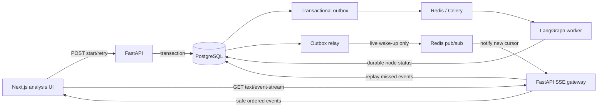

# Slice 2 SSE streaming deep-dive plan

- Status: implementation-ready planning baseline
- Branch: `feature/slice-2`
- Scope: live, one-way progress delivery for Fast Pass and Extended Analysis
- Decision: Server-Sent Events (SSE), not Socket.IO
- Source of truth: PostgreSQL; SSE is a projection, never business truth

## 1. Outcome

While Slice 2 analysis runs asynchronously, an authenticated user sees truthful
progress without waiting on one long HTTP request:

```text
Start analysis
  -> API returns run_id immediately
  -> browser loads the durable run state
  -> browser subscribes to SSE
  -> safe progress events update the UI
  -> completion event causes Overview to refetch
  -> refresh or reconnect resumes from the last event
```

Closing the tab, refreshing the page, losing the network or reconnecting from a
second device must not stop, duplicate or corrupt the analysis.

## 2. Why SSE

Slice 2 needs the server to push status in one direction:

```text
Server -> queued -> parsing -> perceiving -> constructing -> evaluating -> published
```

SSE provides ordered text events, automatic reconnection semantics, event IDs and
normal HTTP authentication/proxy behavior. Socket.IO is intentionally excluded
because Slice 2 does not require bidirectional sockets, rooms, presence or
high-frequency client messages.

Normal user commands such as Start, Retry, Cancel and Answer clarification remain
ordinary authenticated HTTP requests. SSE reports their resulting state changes.

## 3. Architecture



### Ownership boundaries

| Component | Owns | Must not own |
|---|---|---|
| PostgreSQL | Run state, ordered safe events and publication truth | Open network connections |
| LangGraph worker | Node execution, checkpoints and durable phase changes | Browser connection state |
| Transactional outbox | Reliable delivery after commit | Final user-visible state |
| Redis | Live wake-up/fan-out and burst smoothing | Durable event history |
| FastAPI SSE gateway | Authorization, replay, keepalive and streaming | Analysis execution |
| Next.js UI | Rendering and reconnecting | Run truth or artificial timers |

## 4. Authentication and connection decision

The browser will use a same-origin SSE URL. The production reverse proxy routes the
SSE path to FastAPI while preserving the existing secure HttpOnly session cookie:

```text
GET /v1/analysis-runs/{run_id}/events
Accept: text/event-stream
Cookie: oslo_access_token=<HttpOnly; Secure; SameSite=Lax>
Last-Event-ID: <optional event cursor>
```

FastAPI validates the access token, resolves the workspace membership and verifies
that the run belongs to an accessible project before opening the stream.

This avoids placing bearer tokens in JavaScript, URLs or logs. Local development
must use an equivalent same-origin reverse proxy. If the deployment platform cannot
support long-lived proxied responses, the SSE gateway must run with FastAPI on a
stream-capable service; it must not fall back to query-string access tokens.

Security rules:

- Return `404` for inaccessible run IDs to avoid cross-tenant enumeration.
- Revalidate authorization when connecting and periodically for long connections.
- Terminate the stream when the session expires or access is revoked.
- Restrict allowed origin/host and disable cross-origin credentialed SSE.
- Never put raw source text, prompts, model output, secrets or internal exceptions
  in an SSE payload.
- Rate-limit connection attempts per user, workspace and IP.

## 5. Durable event model

Add an append-only safe projection table:

### `analysis_run_events`

| Column | Purpose |
|---|---|
| `id` | Time-sortable server-generated event ID |
| `workspace_id` | RLS tenant boundary |
| `project_id` | Authorization and query scope |
| `analysis_run_id` | Parent run |
| `sequence_no` | Strictly increasing cursor within the run |
| `event_type` | Controlled event name |
| `phase` | Optional safe phase enum |
| `payload_json` | Versioned, redacted event data |
| `occurred_at` | Database timestamp |
| `expires_at` | Operational replay-retention boundary |

Constraints and indexes:

- Unique `(analysis_run_id, sequence_no)`.
- Index `(workspace_id, analysis_run_id, sequence_no)`.
- Foreign keys to the run/project.
- Default-deny RLS using the same workspace policy as analysis runs.
- Payload-size check and a controlled event-type constraint.

An event row and its `outbox_events` row are written in the same transaction as the
associated run-state change. The event table supports replay; Redis only wakes live
connections after that transaction commits.

The table is an operational stream projection, not OSLO History. Durable business
events and completed snapshots remain in their canonical domain tables.

## 6. Event contract

### Wire format

```text
id: 17
event: analysis.phase_started
retry: 3000
data: {"schema_version":"1","run_id":"...","sequence":17,"run_kind":"initial","phase":"perceive","status":"running","occurred_at":"...","progress":{"completed":3,"total":9}}

```

Every event ends with a blank line.

### Common envelope

| Field | Rule |
|---|---|
| `schema_version` | Required; starts at `1` |
| `run_id` | Required; opaque ID |
| `sequence` | Required; monotonic within the run |
| `run_kind` | `initial` or `extended` |
| `phase` | Safe controlled phase or `null` |
| `status` | Safe controlled status |
| `occurred_at` | Server/database timestamp |
| `progress` | Optional coarse completed/total counts |
| `error` | Optional user-safe code and retryability only |

### Allowed events

| Event | Meaning | Client action |
|---|---|---|
| `stream.ready` | Authorization and replay cursor accepted | Mark connection live |
| `stream.reset` | Requested cursor is no longer replayable | Refetch run, reset cursor |
| `analysis.queued` | Durable run created | Show queued state |
| `analysis.started` | Worker claimed run | Show analysis shell |
| `analysis.phase_started` | A safe phase began | Mark phase active |
| `analysis.phase_completed` | A safe phase completed durably | Mark phase complete |
| `analysis.retrying` | A bounded retry was scheduled | Show non-alarming retry state |
| `analysis.completed` | Run completed | Await/refetch published result |
| `analysis.failed` | Run ended safely | Show retryable/terminal message |
| `analysis.cancelled` | User/system cancelled run | Stop progress |
| `assessment.published` | Snapshot and pointer committed | Refetch Overview |
| `extended.queued` | Background deepening was created | Show Extended status |
| `heartbeat` | Optional named liveness event | No UI change |

Internal node names, stack traces and LLM reasoning are excluded. A mapping layer
converts internal nodes to stable user-facing phases so graph refactoring does not
break the UI contract.

## 7. Server streaming behavior

### Connect

1. Validate session and run access.
2. Parse `Last-Event-ID`; reject malformed or future cursors.
3. Read the current durable run state.
4. Replay stored events after the cursor in ascending sequence.
5. Emit `stream.ready` with the latest replayed cursor.
6. Subscribe to the Redis run channel for wake-ups.
7. On every wake-up, query PostgreSQL for events after the current cursor.
8. Stop after a terminal event is delivered or the connection reaches its maximum
   lifetime.

PostgreSQL is queried after every wake-up so a lost or duplicate Redis notification
cannot lose or duplicate a user event.

### Keepalive and proxy settings

- Content type: `text/event-stream; charset=utf-8`.
- Headers: `Cache-Control: no-cache, no-transform` and `X-Accel-Buffering: no`.
- Send a comment heartbeat such as `: keepalive` every 15 seconds.
- Disable response buffering and compression for the SSE route.
- Flush each complete event immediately.
- Set proxy idle timeout above the heartbeat interval.
- Rotate long connections intentionally, for example every 15 minutes, so clients
  exercise normal reconnection and deployments drain cleanly.

### Terminal behavior

After `assessment.published`, `analysis.failed` or `analysis.cancelled`, deliver the
terminal event, allow a short flush window and close the connection. The client
refetches canonical state rather than keeping an unnecessary permanent stream open.

## 8. Client state and reconnection

The UI first fetches:

```text
GET /v1/analysis-runs/{run_id}
```

It renders that durable state before opening SSE, preventing a blank or misleading
screen while the stream connects.

Client rules:

- Store the last applied sequence in memory and `sessionStorage` only as a reconnect
  optimization; PostgreSQL remains truth.
- Ignore duplicate or lower sequence numbers.
- If a sequence gap appears, close and reconnect using the last contiguous cursor.
- Use the server `retry` value with exponential backoff and jitter, capped at
  30 seconds.
- Pause reconnect attempts while the browser is offline.
- On `stream.reset`, refetch the run and Overview, discard the old cursor and reopen.
- On `401`, stop retrying and route to Login while the background run continues.
- On `404`, stop and show an inaccessible/not-found state.
- On `assessment.published`, refetch Overview and verify its `analysis_run_id`.
- Never compute completion from elapsed time or percentage animations.
- Provide visible states for Connecting, Reconnecting and Offline without replacing
  the last durable progress shown.

Multiple tabs may subscribe to the same run. They receive the same ordered events
and do not create additional analysis work.

## 9. Fast Pass and Extended Analysis behavior

### Fast Pass

```text
POST start
  -> run_id returned
  -> SSE: queued / started / safe phases
  -> assessment.published
  -> provisional Overview fetched
```

The UI may show coarse user-facing phases but never streams partial LLM tokens or
unvalidated candidate artifacts. The provisional Overview appears only after atomic
publication.

### Extended Analysis

```text
provisional published
  -> extended.queued
  -> user continues reviewing provisional Overview
  -> separate Extended run stream may be followed
  -> success: current snapshot replaces provisional
  -> failure: provisional/current last-good remains visible
```

Extended progress can be represented in OSLO Chat or a compact background status.
It must not block navigation or blank the existing Overview.

## 10. Failure and edge-case plan

| Scenario | Required result |
|---|---|
| Refresh during Perceive | GET returns running state; SSE replays from cursor |
| Tab closes | Worker continues; reopening restores state |
| Temporary network loss | UI stays on last durable phase and reconnects |
| SSE connects after run completed | Replay terminal events, then refetch Overview |
| SSE event arrives twice | Client ignores duplicate sequence |
| Redis notification is lost | Reconnect/replay from PostgreSQL recovers it |
| Redis notification is duplicated | Cursor query prevents duplicate application |
| SSE gateway restarts | Client reconnects and replays missed events |
| Worker crashes | LangGraph resumes; stream reports later durable transition |
| Database temporarily unavailable | Stream reconnects; no fabricated progress |
| Outbox relay is delayed | Run remains queryable; reconciler republishes wake-up |
| Session expires | Stream closes; login required; run continues |
| Membership revoked mid-stream | Periodic authorization check closes stream |
| Old cursor expired | `stream.reset`, durable state refetch and clean reconnect |
| Two tabs watch one run | Both render same state; no duplicate worker work |
| Newer run supersedes old run | Old stream terminates or reports superseded state |
| Initial fails | Safe failure and Retry; no Overview is fabricated |
| Extended fails | Last-good Overview remains; safe retry option appears |
| Client sends forged run ID | Not found/forbidden without tenant leakage |
| Proxy buffers response | Deployment validation fails; do not release |
| Malformed event payload | Client logs safe telemetry, refetches state and reconnects |

## 11. Scalability and stability

### Initial Alpha design

- One async FastAPI stream task per connected client.
- Redis pub/sub wakes streams; PostgreSQL supplies replayable events.
- Per-user and per-workspace connection caps.
- One active connection per `(user, run, tab)` is acceptable; the client closes old
  connections before opening replacements.
- Bounded event replay page size; continue in pages before switching to live mode.

### Scale-out design

- SSE gateways remain stateless and scale horizontally.
- Any gateway can authorize, replay from PostgreSQL and subscribe to Redis.
- Load balancer stickiness is not required.
- Connection count, file descriptors and memory are capacity-tested per instance.
- Admission control returns a retryable response before exhausting the service.
- Old operational events are removed only after the approved replay window and when
  terminal state remains reconstructable through `analysis_runs`.

### Performance targets

| Measure | Target |
|---|---:|
| Stream authorization/open | p95 under 1 second |
| Commit to event visible in UI | p95 under 2 seconds |
| Reconnect and replay | p95 under 3 seconds |
| Duplicate or lost applied events | 0 |
| Cross-tenant event exposure | 0 |
| Gateway recovery after restart | No manual action |

Load tests must cover concurrent streams, reconnect storms, heartbeat traffic,
terminal bursts and slow clients. The production connection limit is selected from
measured memory/CPU/file-descriptor results, not guessed in the code.

## 12. Observability

Record safe metrics:

- Active SSE connections by instance and workspace bucket.
- Connection opens, closes, duration and close reason.
- Authorization failures and rate-limit rejections.
- Event commit-to-delivery latency.
- Replay count, replay duration and reset count.
- Reconnection rate and heartbeat failures.
- Redis wake-up lag and outbox backlog.
- Slow-client disconnects and per-connection buffered bytes.

Trace IDs:

- `workspace_id`, `project_id`, `analysis_run_id`, correlation ID and event sequence.
- Never log raw access tokens, cookies, prompts, source content or complete event
  payloads.

Alert on sustained delivery-latency breach, reconnect storms, outbox backlog,
gateway saturation, unexpected authorization failures or a run whose durable state
advances while no safe event is written.

## 13. Delivery plan with TDD gates

### Phase 0: contract and ADR

- Record the SSE-over-Socket.IO decision.
- Approve same-origin routing and stream-capable deployment.
- Define event enums, envelope, phase mapping and retention.
- Write contract tests for valid and redacted payloads.

Exit: event schemas validate without a running stream.

### Phase 1: smallest end-to-end tracer

- Deterministic worker writes queued, started, one phase and completed events.
- SSE endpoint authorizes and replays them.
- One Next.js page renders them and refetches a deterministic Overview.

Tests first:

- Authorized user receives ordered events.
- Unauthorized/cross-workspace user receives nothing.
- Completed event causes canonical result refetch.

Exit: UI, FastAPI and PostgreSQL work end to end without Redis or real LLMs.

### Phase 2: live wake-up and reconnect

- Add outbox relay and Redis pub/sub wake-up.
- Add heartbeat, `Last-Event-ID`, cursor replay and terminal close.
- Add reconnecting/offline UI states.

Tests first:

- Disconnect/reconnect delivers each sequence exactly once to UI state.
- Lost/duplicate Redis notifications do not change correctness.
- Refresh during a run restores the latest durable phase.

Exit: live and replay paths behave identically.

### Phase 3: LangGraph integration

- Emit safe events only after node status/checkpoint commits.
- Map internal nodes to stable user-facing phases.
- Integrate retry, failure, cancellation and Extended transition events.

Tests first:

- Worker crash/resume produces a coherent ordered stream.
- Invalid LLM output never emits published/completed truth.
- Extended failure preserves last-good Overview.

Exit: all Slice 2 run transitions have truthful events.

### Phase 4: hardening

- Add connection/rate limits, periodic auth checks and retention cleanup.
- Verify proxy buffering, timeout and graceful deployment drain.
- Run security, accessibility and load tests.
- Add dashboards, alerts and operational runbooks.

Exit: resilience, performance and security acceptance gates pass.

## 14. Test matrix

| Level | Coverage |
|---|---|
| Unit | Event serialization, redaction, cursor comparison, phase mapping |
| Database | Sequence uniqueness, RLS, append-only behavior, event/outbox atomicity |
| Contract | SSE wire format, schema version, safe errors and terminal events |
| API integration | Auth, replay, heartbeat, reset, close and rate limiting |
| Worker integration | Checkpoint/event ordering, retry and duplicate delivery |
| Web component | Connecting, live, reconnecting, offline, failed and completed states |
| E2E | Start, progress, refresh, session expiry, completion and Overview refetch |
| Security | Cross-tenant IDs, token leakage, Origin/Host abuse and revoked access |
| Resilience | Redis/API/gateway/worker restarts and outbox delay |
| Load | Concurrent connections, reconnect storm, slow client and terminal burst |
| Accessibility | Live-region announcements without excessive repeated speech |

## 15. Acceptance criteria

- Slice 2 uses SSE and ordinary HTTP commands; Socket.IO is not introduced.
- Starting analysis returns quickly with a durable `run_id`.
- Events are ordered, versioned, redacted and tenant-authorized.
- Refresh, disconnect and gateway restart do not lose progress.
- Duplicate events do not create duplicate UI transitions.
- Redis loss cannot lose committed progress.
- The browser never displays unvalidated LLM output as truth.
- Fast Pass publishes Provisional only after an atomic completed transaction.
- Extended failure preserves the last-good Overview.
- Session expiry or membership revocation closes protected streams safely.
- The stream works through the approved production proxy without buffering.
- Contract, RLS, integration, E2E, resilience, security and load gates pass.

## 16. Implementation start point

Build only this first:

```text
Authenticated deterministic run
  -> PostgreSQL run + four safe events
  -> authorized SSE replay
  -> live UI phase update
  -> browser refresh
  -> replay from Last-Event-ID
  -> deterministic Overview refetch
```

Do not connect real LLM nodes until this tracer is green through database, API,
browser and Playwright tests.
